# 결제 시스템 아키텍처 (SPEC-SERVER-002)

MSQPay 결제 시스템의 아키텍처 설계 및 구현 내용입니다. 무상태 설계를 통해 스마트 컨트랙트를 단일 진실 공급원(Single Source of Truth)으로 사용합니다.

## 시스템 아키텍처 개요

### C4 Context 다이어그램

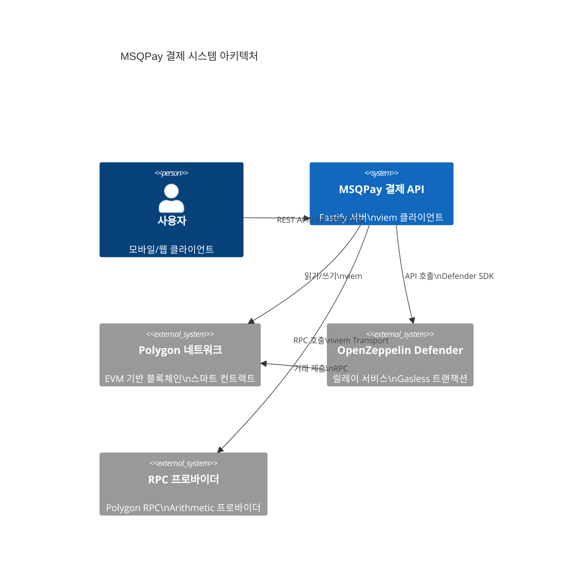

### C4 Container 다이어그램

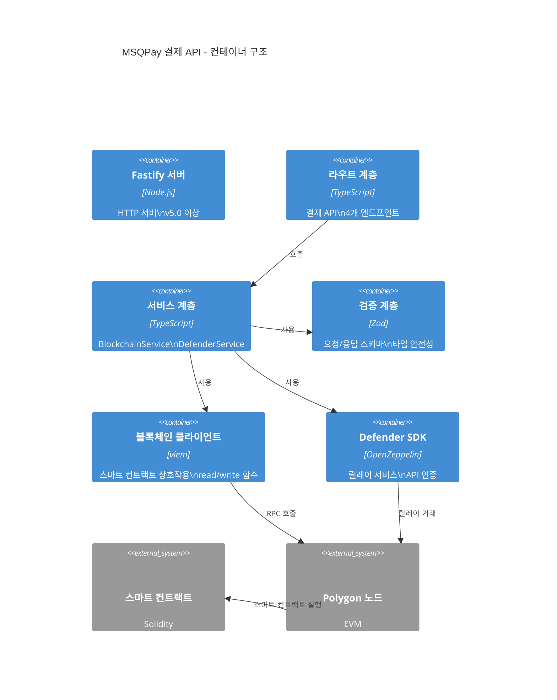

---

## 결제 흐름 (Payment Flow)

### 1. 결제 생성 플로우 (Create Payment)

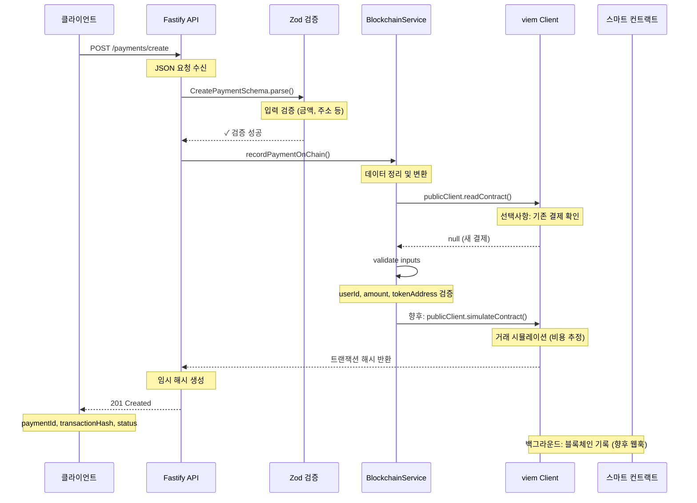

### 2. 결제 상태 조회 플로우 (Get Payment Status)

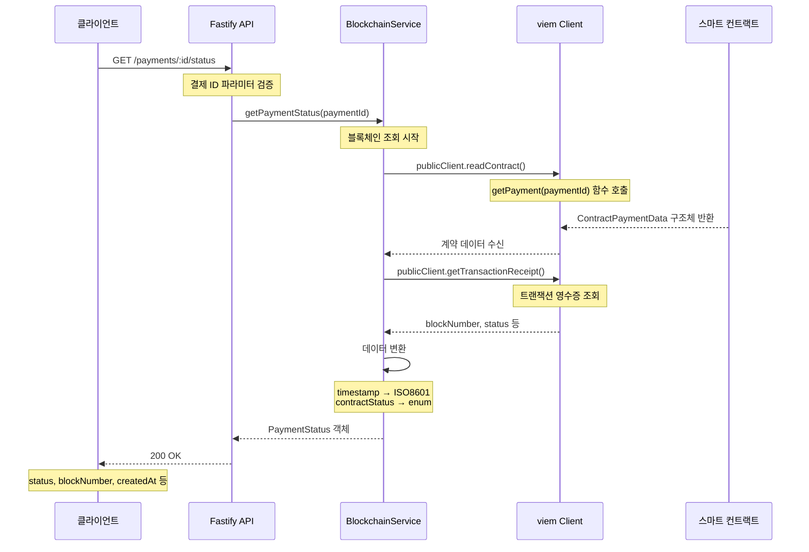

### 3. Gasless 거래 플로우 (Gasless Transaction)

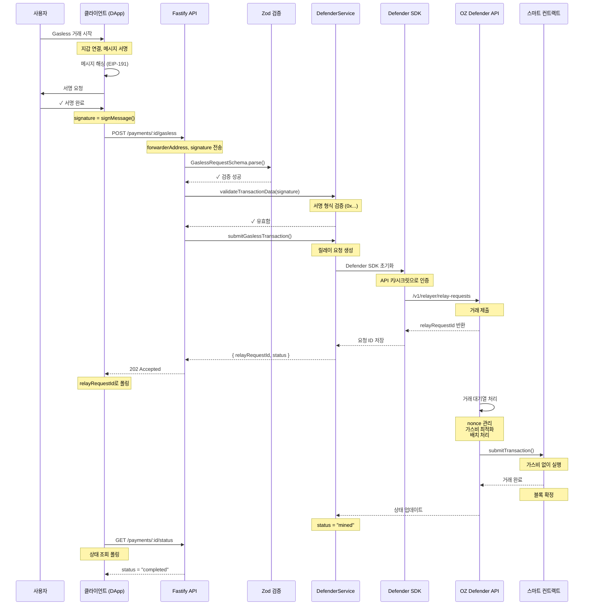

### 4. 릴레이 거래 플로우 (Relay Transaction)

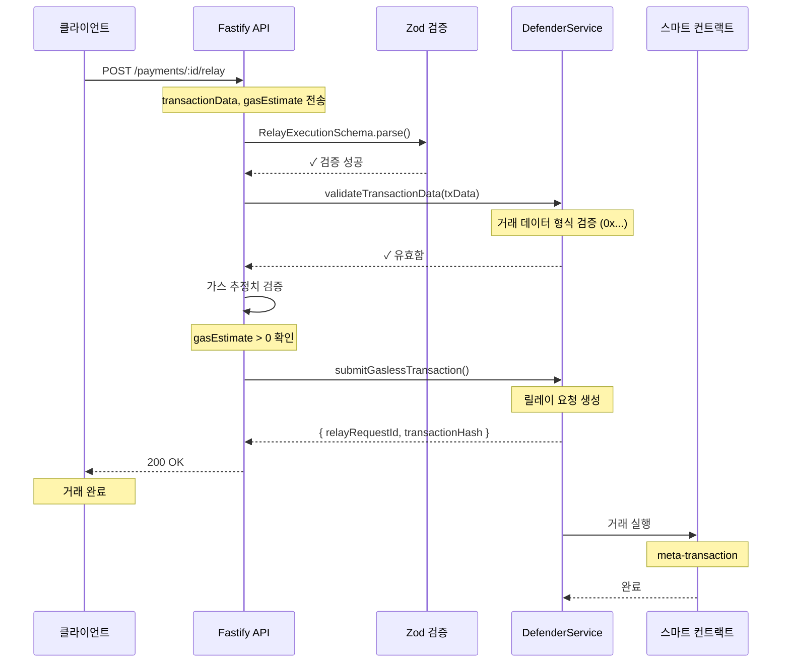

---

## 데이터 모델

### ContractPaymentData (스마트 컨트랙트)

```typescript
interface ContractPaymentData {
  userId: string;              // 사용자 ID (indexed)
  amount: bigint;              // 결제 금액 (Wei/token units)
  currency: 'USD' | 'EUR' | 'KRW';  // 통화 코드
  tokenAddress: string;        // ERC-20 토큰 계약 주소
  recipientAddress: string;    // 수령자 지갑 주소
  status: number;              // 상태 (0=pending, 1=confirmed, 2=failed, 3=completed)
  transactionHash?: `0x${string}`;  // 트랜잭션 해시
  createdAt: bigint;           // 생성 시간 (Unix timestamp)
  updatedAt: bigint;           // 수정 시간 (Unix timestamp)
}
```

### PaymentStatus (API 응답)

```typescript
interface PaymentStatus {
  paymentId: string;           // 결제 ID (변경: id → paymentId)
  userId: string;              // 사용자 ID
  amount: number;              // 결제 금액 (정수)
  tokenSymbol: string;         // 토큰 심볼 (변경: currency → tokenSymbol, 온체인 조회)
  tokenAddress: string;        // 토큰 주소
  recipientAddress: string;    // 수령자 주소
  status: 'pending' | 'confirmed' | 'failed' | 'completed';
  transactionHash?: string;    // TX 해시
  blockNumber?: number;        // 블록 번호
  createdAt: ISO8601String;   // ISO 형식 생성 시간
  updatedAt: ISO8601String;   // ISO 형식 수정 시간
}
```

> **Note (2025-11-30)**: API 필드 변경사항
> - `id` → `paymentId`: 일관된 명명 규칙 적용
> - `currency` → `tokenSymbol`: 온체인 ERC20 컨트랙트에서 `symbol()` 함수로 조회

---

## 무상태 아키텍처 설계

### 핵심 원칙

1. **스마트 컨트랙트 = Single Source of Truth**
   - 모든 결제 데이터는 스마트 컨트랙트에만 저장
   - API는 읽기 전용으로 블록체인 조회
   - 데이터베이스/캐시 없음

2. **API는 트랜잭션 생성자**
   - 새로운 결제 요청 검증
   - 스마트 컨트랙트에 기록 (향후 구현)
   - 거래 상태를 실시간으로 조회

3. **확장성 및 신뢰성**
   - 블록체인 = 영구 저장소
   - 분산화된 데이터 관리
   - 감시자 없음 (Trustless)

### 아키텍처 다이어그램

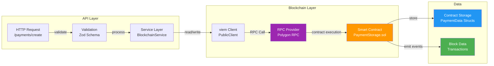

---

## 기술 스택

| 계층 | 기술 | 버전 | 용도 |
|------|------|------|------|
| **HTTP 서버** | Fastify | v5.0+ | 고성능 Node.js 웹 프레임워크 |
| **언어** | TypeScript | v5.3+ | 타입 안전성 |
| **블록체인** | viem | v2.21+ | EVM 상호작용 (type-safe) |
| **검증** | Zod | v3.22+ | 요청/응답 스키마 검증 |
| **Gasless** | OZ Defender | Latest | 릴레이 서비스 |
| **테스트** | Vitest | v1.0+ | 고속 단위 테스트 |
| **네트워크** | Polygon | - | EVM 호환 블록체인 |

---

## 에러 처리 및 재시도

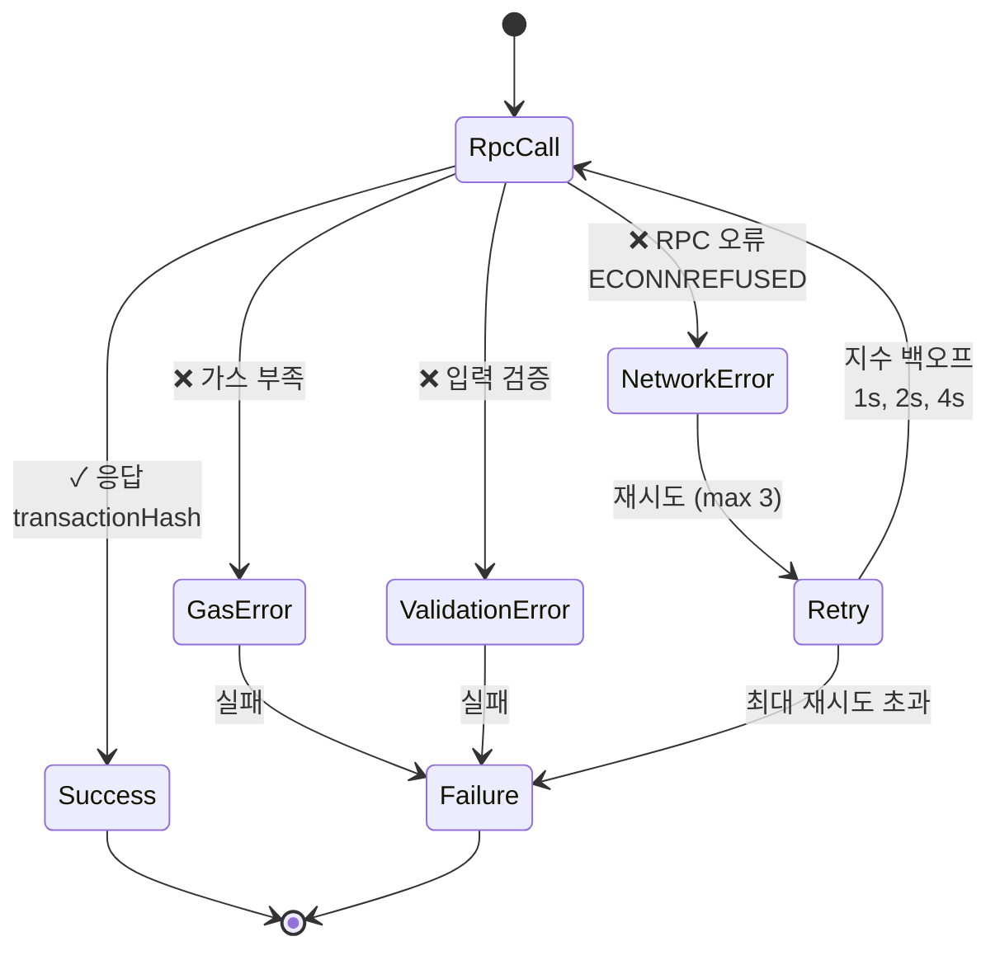

### 재시도 정책

- **최대 재시도**: 3회
- **백오프 전략**: 지수 백오프 (1초, 2초, 4초)
- **재시도 대상**:
  - RPC 네트워크 오류
  - 임시 타임아웃
  - 논스(nonce) 충돌

### 에러 코드

```typescript
enum ErrorCode {
  VALIDATION_ERROR = 'VALIDATION_ERROR',      // 400
  INVALID_REQUEST = 'INVALID_REQUEST',        // 400
  INVALID_SIGNATURE = 'INVALID_SIGNATURE',    // 400
  INVALID_TRANSACTION_DATA = 'INVALID_TRANSACTION_DATA',  // 400
  INVALID_GAS_ESTIMATE = 'INVALID_GAS_ESTIMATE',  // 400
  NOT_FOUND = 'NOT_FOUND',                    // 404
  INTERNAL_ERROR = 'INTERNAL_ERROR',          // 500
}
```

---

## 보안 고려사항

### 1. 입력 검증

```typescript
// Zod 스키마로 타입 안전성 보장
const CreatePaymentSchema = z.object({
  userId: z.string().min(1),
  amount: z.number().positive(),
  currency: z.enum(['USD', 'EUR', 'KRW']),
  tokenAddress: z.string().regex(/^0x[a-fA-F0-9]{40}$/),
  recipientAddress: z.string().regex(/^0x[a-fA-F0-9]{40}$/),
});
```

### 2. 주소 검증

```typescript
// viem Address 타입으로 런타임 검증
import { Address, isAddress } from 'viem';

const tokenAddress: Address = validatedData.tokenAddress as Address;
// 컴파일 시 + 런타임 타입 안전성
```

### 3. 서명 검증

```typescript
// Gasless 거래 서명 형식 검증
validateTransactionData(signature: string): boolean {
  return /^0x[a-fA-F0-9]{130}$/.test(signature);  // EIP-191 형식
}
```

### 4. 가스 비용 보호

```typescript
// 가스 추정치 검증
if (validatedData.gasEstimate <= 0) {
  throw new Error('가스 추정치는 양수여야 합니다');
}
```

---

## 성능 최적화

### 1. RPC 요청 최적화

- **PublicClient 재사용**: 싱글톤 패턴
- **배치 요청**: 여러 호출 병렬화
- **캐싱**: 읽기 전용 데이터 (향후 구현)

### 2. 거래 처리 최적화

```typescript
// viem 특성 활용
const result = await publicClient.readContract({
  address: contractAddress,
  abi: contractAbi,
  functionName: 'getPayment',
  args: [paymentId],
});
// 자동 ABI 타입 체크, 에러 처리
```

### 3. Defender 릴레이 최적화

- **배치 처리**: 다중 거래 한 번에 처리
- **Nonce 관리**: 자동 논스 관리
- **가스비 최적화**: Polygon 네트워크 활용

---

## 모니터링 및 로깅

### 로깅 포인트

```typescript
// 구현 예제
logger.info('Payment created', { paymentId, userId, amount });
logger.error('RPC call failed', { error, retries, endpoint });
logger.warn('High gas price detected', { gasPrice, threshold });
```

### 메트릭 수집 (향후)

- 결제 생성 수
- API 응답 시간
- RPC 오류율
- Defender 릴레이 성공률

---

## API 라우트 흐름도

### 결제 관련 API

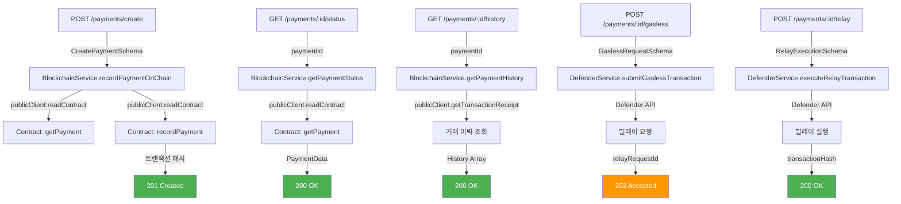

### 토큰 조회 API

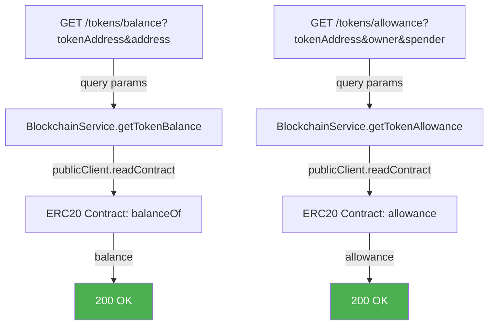

### 거래 상태 조회 API

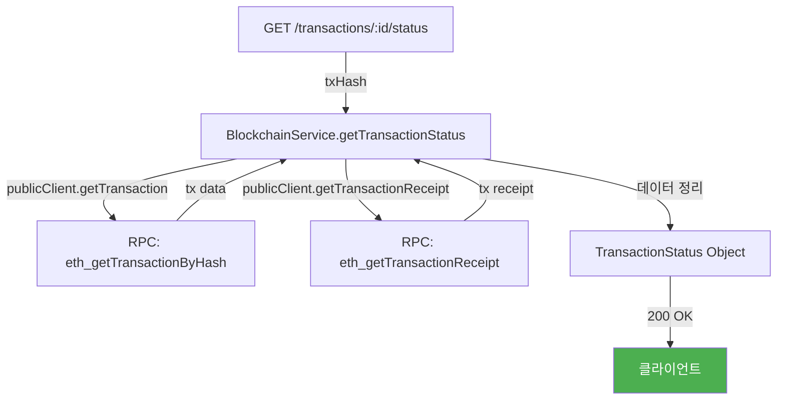

### 통합 결제 흐름 (클라이언트 API 기반)

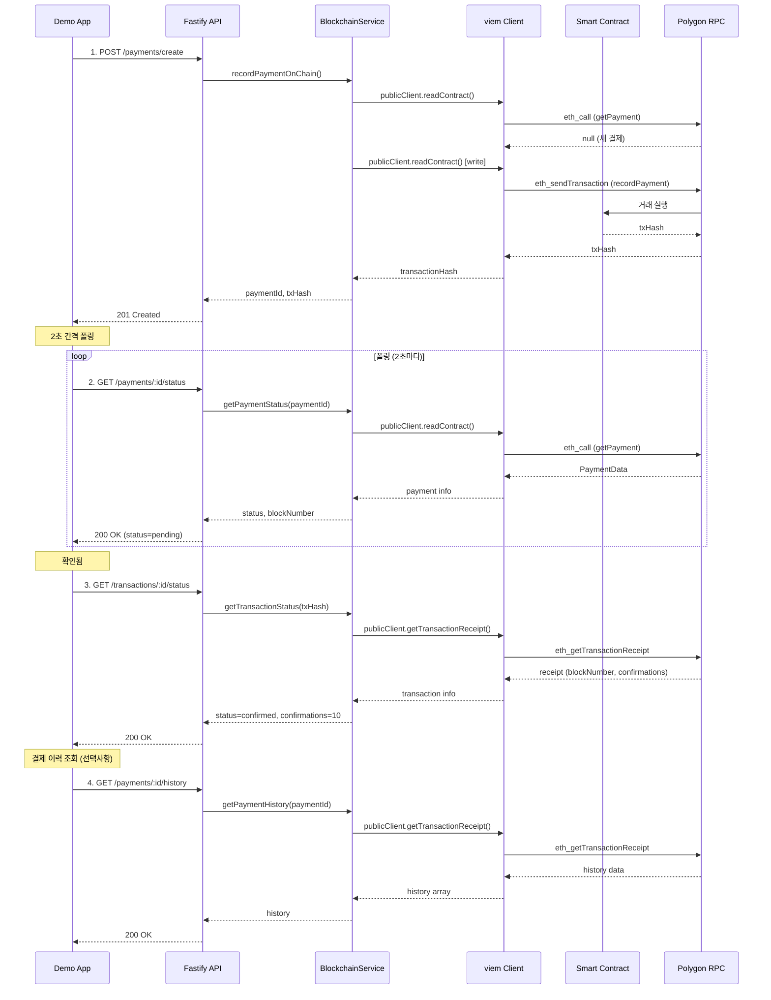

---

## 향후 개선 사항

1. **데이터베이스 캐싱**: 자주 조회되는 결제 캐싱
2. **WebSocket 지원**: 실시간 결제 상태 업데이트
3. **이벤트 구독**: 스마트 컨트랙트 이벤트 구독
4. **메트릭 수집**: Prometheus 통합
5. **GraphQL API**: REST 대신 GraphQL
6. **다중 체인**: Ethereum, Arbitrum 등 지원

---

## 관련 문서

- [API 레퍼런스](./api/payments.md)
- [구현 가이드](./implementation/payments-api.md)
- [배포 가이드](./deployment/payments-setup.md)
- [기술 스펙](./technical-spec.md)
