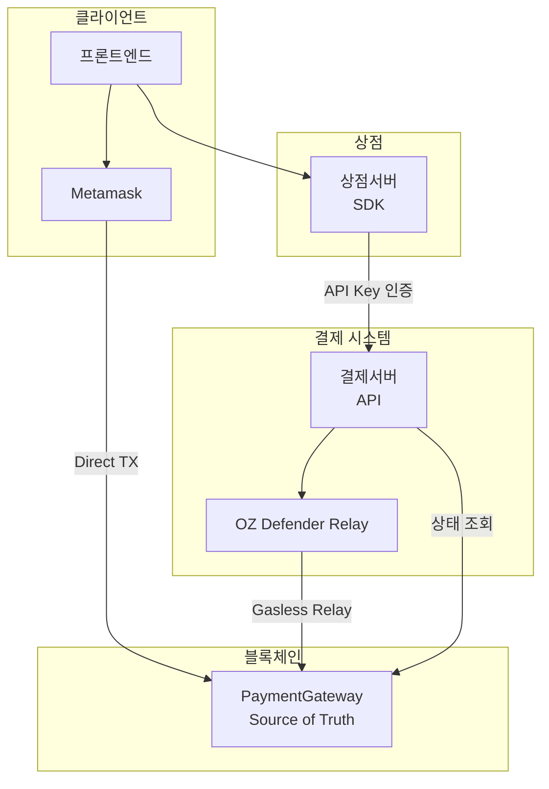
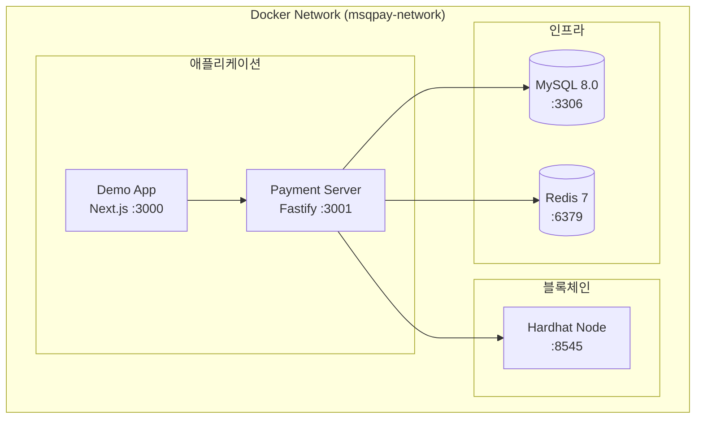
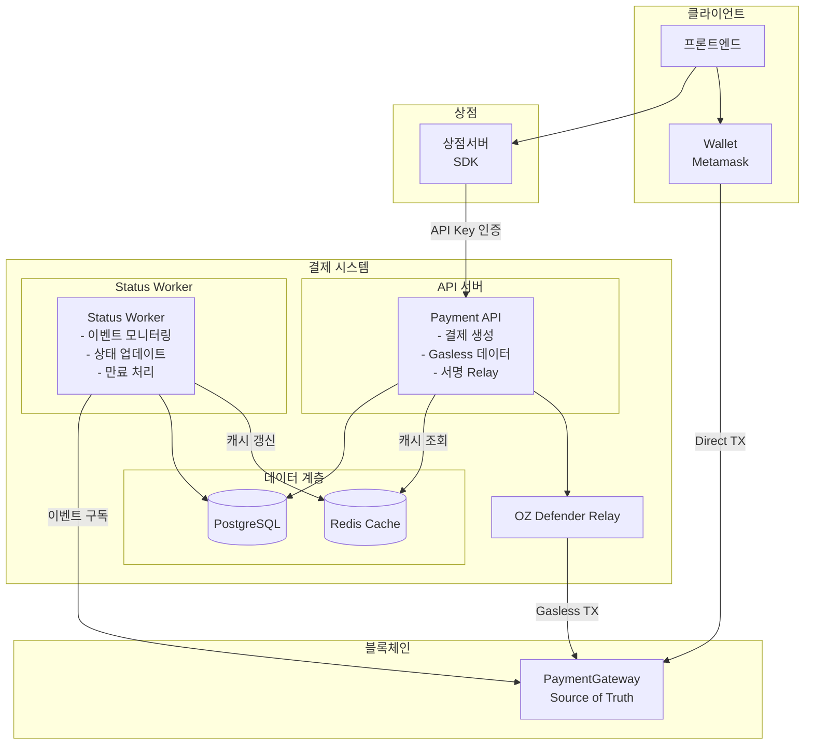
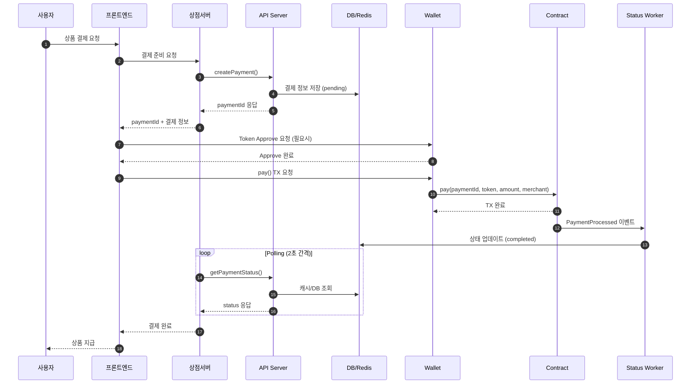
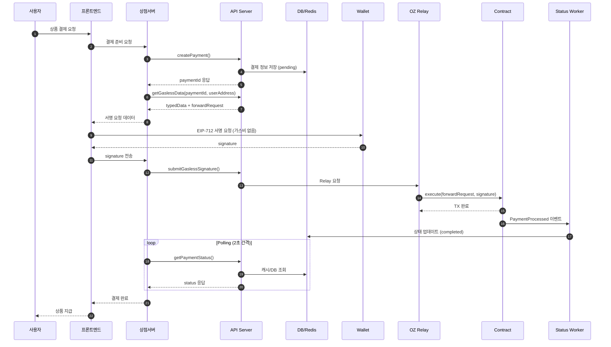

# MSQPay - 아키텍처 문서

## Document Information
- **Version**: 1.0
- **Date**: 2025-11-27
- **Status**: Approved

---

## 1. 핵심 원칙

| 원칙 | 설명 |
|------|------|
| **Contract = Source of Truth** | 결제 완료 여부는 오직 스마트 컨트랙트만 신뢰 |
| **Stateless MVP** | DB/Redis/이벤트 모니터링 없이 Contract 직접 조회 |
| **동일 API 인터페이스** | MVP와 Production 모두 같은 API 형태 |
| **서버 발급 paymentId** | 결제서버가 유일한 paymentId 생성자 |
| **상점서버 ↔ 블록체인 분리** | 상점서버는 결제서버 API만 호출, 블록체인 접근 불가 |

---

## 2. 시스템 구성

### 2.1 아키텍처 다이어그램



### 2.2 접근 제어

| 경로 | 허용 | 인증 방식 |
|------|------|----------|
| 프론트 → 상점서버 | O | 세션/토큰 |
| 프론트 → 결제서버 | X | API Key로 차단 |
| 상점서버 → 결제서버 | O | API Key 인증 |
| 상점서버 → 블록체인 | X | 결제서버 통해서만 |

---

## 2.5 로컬 개발 환경

### Docker Compose 아키텍처



### 서비스 구성

| 서비스 | 이미지/타겟 | 포트 | 용도 |
|--------|------------|------|------|
| mysql | mysql:8.0 | 3306 | 결제 데이터 |
| redis | redis:7-alpine | 6379 | 캐싱 |
| hardhat | Dockerfile.packages:hardhat | 8545 | 로컬 블록체인 |
| server | Dockerfile.packages:server | 3001 | Payment API |
| demo | Dockerfile.packages:demo | 3000 | 프론트엔드 |

### 의존성 순서

```
mysql + redis + hardhat (병렬 시작, healthcheck)
         ↓
      server (depends_on: service_healthy)
         ↓
       demo (depends_on: service_started)
```

### 환경변수 (하드코딩)

Docker Compose 파일에 모든 환경변수가 직접 포함되어 있습니다:

- **MySQL**: root/pass
- **Contract 주소**: Hardhat 결정론적 주소 사용
- **API Keys**: 테스트용 키 직접 포함

---

## 3. 결제서버 API

### 3.1 API 목록

| 엔드포인트 | 메서드 | 용도 |
|-----------|--------|------|
| `/payments/create` | POST | 결제 생성, paymentId 발급 |
| `/payments/:id/status` | GET | 결제 상태 조회 (Contract 조회) |
| `/payments/:id/gasless` | GET | Gasless 서명 데이터 조회 |
| `/payments/:id/relay` | POST | Gasless 서명 제출 → Relay |

### 3.2 POST /payments/create

**Headers**:
```
x-api-key: sk_test_abc123
```

**Request**:
```json
{
  "orderId": "order_123",
  "amount": "1000000000000000000",
  "token": "0xE4C687167705Abf55d709395f92e254bdF5825a2",
  "merchant": "0x..."
}
```

**Response**:
```json
{
  "paymentId": "0xabc123...",
  "orderId": "order_123",
  "amount": "1000000000000000000",
  "token": "0xE4C...",
  "merchant": "0x...",
  "status": "pending"
}
```

**동작**:
| 버전 | amount/token/merchant |
|------|----------------------|
| MVP | 받기만 하고 무시 (검증 안함) |
| Production | DB 저장 후 결제 완료 시 검증 |

### 3.3 GET /payments/:id/status

**Response**:
```json
{
  "paymentId": "0xabc123...",
  "status": "completed"
}
```

| status | 의미 |
|--------|------|
| `pending` | `processedPayments[paymentId] == false` |
| `completed` | `processedPayments[paymentId] == true` |

**내부 동작**:
```typescript
const isProcessed = await contract.read.processedPayments([paymentId]);
return { status: isProcessed ? 'completed' : 'pending' };
```

### 3.4 GET /payments/:id/gasless

**Request**: `?userAddress=0xUser...`

**Response**:
```json
{
  "nonce": "5",
  "forwardRequest": {
    "from": "0xUser...",
    "to": "0xGateway...",
    "value": "0",
    "gas": "200000",
    "nonce": "5",
    "deadline": "1732780800",
    "data": "0x..."
  },
  "typedData": {
    "domain": {
      "name": "ERC2771Forwarder",
      "version": "1",
      "chainId": 80002,
      "verifyingContract": "0xForwarder..."
    },
    "types": {
      "ForwardRequest": [
        { "name": "from", "type": "address" },
        { "name": "to", "type": "address" },
        { "name": "value", "type": "uint256" },
        { "name": "gas", "type": "uint256" },
        { "name": "nonce", "type": "uint256" },
        { "name": "deadline", "type": "uint48" },
        { "name": "data", "type": "bytes" }
      ]
    },
    "primaryType": "ForwardRequest",
    "message": { "..." }
  }
}
```

### 3.5 POST /payments/:id/relay

**Request**:
```json
{
  "signature": "0x...",
  "forwardRequest": {
    "from": "0xUser...",
    "to": "0xGateway...",
    "value": "0",
    "gas": "200000",
    "nonce": "5",
    "deadline": "1732780800",
    "data": "0x..."
  }
}
```

**Response**:
```json
{
  "txHash": "0x...",
  "status": "submitted"
}
```

---

## 4. paymentId 생성

결제서버에서 Node.js로 생성 (스마트 컨트랙트 아님):

```typescript
import { keccak256, toBytes, concat } from 'viem';
import { randomBytes } from 'crypto';

function generatePaymentId(storeId: string, orderId: string): `0x${string}` {
  return keccak256(
    concat([
      toBytes(storeId),      // API Key에서 추출
      toBytes(orderId),      // 상점서버 요청
      randomBytes(32)        // 매번 다른 ID 보장
    ])
  );
}
```

**특징**:
- 같은 상점 + 같은 orderId → 항상 다른 paymentId
- storeId 포함 → 상점간 충돌 불가
- randomBytes 포함 → 동일 요청도 매번 새로운 ID

---

## 5. API Key 관리

### 5.1 MVP: 환경변수

```bash
# .env
STORE_API_KEYS='{
  "sk_test_abc123": { "storeId": "store_001", "name": "Demo Store" },
  "sk_test_def456": { "storeId": "store_002", "name": "Test Shop" }
}'
```

```typescript
function validateApiKey(apiKey: string): StoreInfo | null {
  const stores = JSON.parse(process.env.STORE_API_KEYS);
  return stores[apiKey] || null;
}
```

### 5.2 Production: DB

```sql
CREATE TABLE stores (
  id VARCHAR(36) PRIMARY KEY,
  api_key VARCHAR(64) UNIQUE,
  name VARCHAR(255),
  webhook_url VARCHAR(512),
  created_at TIMESTAMP
);
```

### 5.3 API Key 형식

```
sk_test_[random32chars]  -- 테스트용
sk_live_[random32chars]  -- 프로덕션용
```

---

## 6. SDK (`@globalmsq/msqpay`)

### 6.1 설정

```typescript
type Environment = 'development' | 'staging' | 'production' | 'custom';

interface MSQPayConfig {
  environment: Environment;
  apiKey: string;
  customApiUrl?: string;  // environment가 'custom'일 때만
}

// 환경별 기본 URL
const API_URLS = {
  development: 'http://localhost:3001',
  staging: 'https://pay-api.staging.msq.com',
  production: 'https://pay-api.msq.com'
};
```

### 6.2 클래스

```typescript
class MSQPayClient {
  constructor(config: MSQPayConfig);

  // URL 관리 (custom용)
  setApiUrl(url: string): void;
  getApiUrl(): string;

  // 공통
  createPayment(params: CreatePaymentParams): Promise<Payment>;
  getPaymentStatus(paymentId: string): Promise<PaymentStatus>;

  // Gasless
  getGaslessData(paymentId: string, userAddress: string): Promise<GaslessData>;
  submitGaslessSignature(
    paymentId: string,
    signature: string,
    forwardRequest: ForwardRequest
  ): Promise<RelayResult>;
}
```

### 6.3 인터페이스

```typescript
interface CreatePaymentParams {
  orderId: string;
  amount: string;           // wei 단위
  token: `0x${string}`;     // 토큰 주소
  merchant: `0x${string}`;  // 수취인 주소
}

interface Payment {
  paymentId: `0x${string}`;
  orderId: string;
  amount: string;
  token: `0x${string}`;
  merchant: `0x${string}`;
  status: 'pending' | 'completed';
}

interface PaymentStatus {
  paymentId: `0x${string}`;
  status: 'pending' | 'completed';
}

interface GaslessData {
  nonce: string;
  forwardRequest: ForwardRequest;
  typedData: TypedData;
}

interface RelayResult {
  txHash: `0x${string}`;
  status: 'submitted' | 'confirmed' | 'failed';
}
```

### 6.4 사용 예시

```typescript
import { MSQPayClient } from '@globalmsq/msqpay';

// 초기화
const client = new MSQPayClient({
  environment: 'development',
  apiKey: 'sk_test_abc123'
});

// Custom URL 사용
const customClient = new MSQPayClient({
  environment: 'custom',
  apiKey: 'sk_test_abc123',
  customApiUrl: 'https://my-test-server.com'
});

// 결제 생성
const payment = await client.createPayment({
  orderId: 'order_123',
  amount: '1000000000000000000',
  token: '0xE4C...',
  merchant: '0x...'
});

// 상태 조회
const status = await client.getPaymentStatus(payment.paymentId);

// Gasless 데이터 요청
const gaslessData = await client.getGaslessData(payment.paymentId, userAddress);

// 서명 제출
const result = await client.submitGaslessSignature(
  payment.paymentId,
  signature,
  gaslessData.forwardRequest
);
```

---

## 7. 결제 플로우

### 7.1 Direct Payment

```
1. 프론트 → 상점서버: 상품 ID 전송 (productId만, amount 절대 불가)
2. 상점서버: DB/설정에서 실제 상품 가격 조회
3. 상점서버: client.createPayment({ amount: 조회된_가격 })
4. 결제서버: paymentId 생성, 응답
5. 상점서버 → 프론트: paymentId + 결제 정보
6. 프론트 → Metamask → Contract: pay() TX
7. 상점서버: client.getPaymentStatus() polling
8. 결제서버 → Contract: processedPayments 조회
9. 완료 확인 → 상품 지급
```

> **⚠️ 보안 필수사항**: 프론트엔드에서 결제 금액(amount)을 직접 전송하면 안됩니다.
> 악의적 사용자가 금액을 조작할 수 있으므로, 반드시 상점서버에서 상품 가격을 조회해야 합니다.

### 7.2 Gasless Payment

```
1. 프론트 → 상점서버: 상품 ID 전송 (productId만, amount 절대 불가)
2. 상점서버: DB/설정에서 실제 상품 가격 조회
3. 상점서버: client.createPayment({ amount: 조회된_가격 })
4. 결제서버: paymentId 생성, 응답
5. 상점서버: client.getGaslessData(paymentId, userAddress)
6. 결제서버: Forwarder nonce 조회, typedData 생성
7. 상점서버 → 프론트: typedData
8. 프론트 → Metamask: EIP-712 서명 (TX 없음, 가스비 없음)
9. 프론트 → 상점서버: signature
10. 상점서버: client.submitGaslessSignature()
11. 결제서버 → OZ Defender → Contract: 가스비 대납 TX
12. 상점서버: client.getPaymentStatus() polling
13. 완료 확인 → 상품 지급
```

> **⚠️ 보안 필수사항**: Direct Payment와 동일하게, 프론트엔드에서 금액을 전송하면 안됩니다.

---

## 8. 프론트엔드 샘플 코드

SDK 없이 wagmi/viem 사용:

### 8.1 Direct Payment

```typescript
import { useWriteContract } from 'wagmi';
import { parseUnits } from 'viem';

const { writeContract } = useWriteContract();

// 결제 실행
await writeContract({
  address: GATEWAY_ADDRESS,
  abi: PaymentGatewayABI,
  functionName: 'pay',
  args: [paymentId, token, parseUnits(amount, 18), merchant]
});
```

### 8.2 Gasless Payment

```typescript
import { useSignTypedData } from 'wagmi';

const { signTypedData } = useSignTypedData();

// 서명 (가스비 없음)
const signature = await signTypedData({
  domain: typedData.domain,
  types: typedData.types,
  primaryType: typedData.primaryType,
  message: typedData.message
});

// signature를 상점서버로 전송
await fetch('/api/payments/relay', {
  method: 'POST',
  body: JSON.stringify({ paymentId, signature, forwardRequest })
});
```

---

## 9. MVP vs Production

| 항목 | MVP | Production |
|------|-----|------------|
| 서버 구조 | 단일 결제서버 | API 서버 + Status Worker 분리 |
| DB | 없음 | PostgreSQL |
| Redis | 없음 | 상태 캐시 |
| 이벤트 모니터링 | 없음 | 블록체인 이벤트 구독 |
| 결제 검증 | Contract만 조회 | Contract + DB 비교 |
| API Key | 환경변수 | DB |
| 금액 검증 | 없음 | DB 저장값과 비교 |
| 결제 상태 | `pending`, `completed` | + `expired`, `failed` |
| **API 인터페이스** | **동일** | **동일** |

---

## 10. Production 아키텍처 (향후)

> ⚠️ **Note**: 이 섹션은 MVP 완료 후 구현 예정입니다.

### 10.1 서버 분리 구조



### 10.2 서버 역할 분리

| 서버 | 역할 | Stateless |
|------|------|-----------|
| **API Server** | 외부 요청 처리, 결제 생성, Relay | O |
| **Status Worker** | 블록체인 이벤트 모니터링, 상태 동기화 | X |

### 10.3 API Server

**책임**:
- 결제 생성 (`POST /payments/create`) → DB 저장
- 상태 조회 (`GET /payments/:id/status`) → Redis 캐시 우선
- Gasless 데이터 생성 (`GET /payments/:id/gasless`)
- 서명 Relay (`POST /payments/:id/relay`)

**특징**:
- Stateless 설계로 수평 확장 가능
- Redis 캐시로 빠른 상태 응답
- DB에 결제 정보 영구 저장

### 10.4 Status Worker

**책임**:
- 블록체인 `PaymentProcessed` 이벤트 구독
- DB 결제 상태 업데이트 (`pending` → `completed`)
- Redis 캐시 갱신
- 만료 결제 처리 (`pending` → `expired`)

**구현 방식**:
```typescript
// 이벤트 구독 (viem watchContractEvent)
publicClient.watchContractEvent({
  address: GATEWAY_ADDRESS,
  abi: PaymentGatewayABI,
  eventName: 'PaymentProcessed',
  onLogs: async (logs) => {
    for (const log of logs) {
      const { paymentId, payer, token, amount, merchant } = log.args;

      // DB 업데이트
      await db.payment.update({
        where: { paymentId },
        data: {
          status: 'completed',
          txHash: log.transactionHash,
          completedAt: new Date()
        }
      });

      // Redis 캐시 갱신
      await redis.set(`payment:${paymentId}`, 'completed', 'EX', 3600);
    }
  }
});
```

**만료 처리**:
```typescript
// 크론잡 (1분 간격)
async function processExpiredPayments() {
  const expiredPayments = await db.payment.findMany({
    where: {
      status: 'pending',
      createdAt: { lt: subMinutes(new Date(), 30) }  // 30분 초과
    }
  });

  for (const payment of expiredPayments) {
    await db.payment.update({
      where: { id: payment.id },
      data: { status: 'expired' }
    });
    await redis.set(`payment:${payment.paymentId}`, 'expired', 'EX', 3600);
  }
}
```

### 10.5 결제 플로우 (Production)

#### Direct Payment 시퀀스



#### Gasless Payment 시퀀스



### 10.6 데이터 흐름 요약

| 단계 | Direct Payment | Gasless Payment |
|------|---------------|-----------------|
| 1. 결제 생성 | API Server → DB 저장 | 동일 |
| 2. TX 실행 | 사용자 Wallet → Contract | OZ Relay → Contract |
| 3. 이벤트 감지 | Status Worker 구독 | 동일 |
| 4. 상태 갱신 | DB + Redis 업데이트 | 동일 |
| 5. 완료 확인 | 상점서버 Polling | 동일 |

### 10.7 확장성

| 구성요소 | 확장 방식 |
|----------|----------|
| API Server | 수평 확장 (로드밸런서) |
| Status Worker | 단일 인스턴스 (이벤트 중복 방지) |
| PostgreSQL | Read Replica |
| Redis | Cluster 모드 |

### 10.8 MVP → Production 마이그레이션

| 단계 | 작업 |
|------|------|
| 1 | PostgreSQL 스키마 생성 |
| 2 | Redis 캐시 계층 추가 |
| 3 | API Server에 DB/Redis 연동 |
| 4 | Status Worker 개발 및 배포 |
| 5 | 이벤트 구독 테스트 |
| 6 | 기존 Contract 상태 동기화 |

---

## 11. 제공물 정리

| 대상 | 제공물 | 설명 |
|------|--------|------|
| 상점서버 | `@globalmsq/msqpay` | npm 패키지 |
| 프론트엔드 | 샘플 코드 | wagmi/viem 예시 |
| 결제서버 | 직접 구현 | Express/Fastify 기반 |

---

## 12. 기술 스택

| 구성요소 | 기술 |
|----------|------|
| Blockchain | Polygon Amoy (Testnet) |
| Smart Contract | Solidity 0.8.24, OpenZeppelin 5.0+ |
| 결제서버 | Node.js + Express/Fastify |
| SDK | TypeScript + axios |
| Relay | OpenZeppelin Defender |
| 프론트엔드 | wagmi 2.5+, viem 2.0+ |

---

## 13. 보안 설계

### 13.1 클라이언트 조작 방지

| 위협 | 대응 |
|------|------|
| 가짜 paymentId 생성 | 결제서버만 paymentId 발급 |
| 결제 완료 위조 | Contract에서 직접 조회 |
| **금액 조작 (Direct)** | **상점서버에서 상품 가격 조회 (프론트 amount 수신 금지)** |
| 금액 조작 (Gasless) | 서명 데이터에서 amount 확인 |
| 상점 위장 | API Key 인증 |

> **⚠️ 핵심 보안 원칙**: 프론트엔드는 `productId`만 전송하고, 상점서버가 DB/설정에서 실제 가격을 조회하여 결제서버에 전달해야 합니다. 프론트엔드에서 `amount`를 직접 받으면 악의적 사용자가 금액을 조작할 수 있습니다.

### 13.2 컨트랙트 보안

| 위험 | 대응 |
|------|------|
| Reentrancy | ReentrancyGuard 적용 |
| Replay Attack | processedPayments로 중복 방지 |
| Meta-tx Replay | Forwarder nonce + deadline |

---

## 14. 용어 정의

| 용어 | 설명 |
|------|------|
| Direct Payment | 사용자가 직접 가스비를 지불하는 블록체인 트랜잭션 |
| Gasless Payment | 서비스가 가스비를 대납하는 Meta Transaction 방식 |
| paymentId | 결제서버가 발급하는 고유 결제 식별자 (bytes32) |
| EIP-2771 | Meta Transaction을 위한 Ethereum 표준 (Trusted Forwarder) |
| EIP-712 | 구조화된 데이터 서명을 위한 Ethereum 표준 |
| Source of Truth | 신뢰할 수 있는 유일한 데이터 소스 (여기서는 Contract) |
