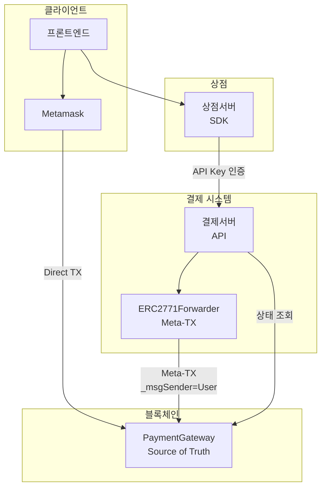

# Product Requirements Document (PRD)
## MSQPay - Blockchain Payment Gateway

### Document Information
- **Version**: 1.0 (MVP)
- **Date**: 2025-11-27
- **Status**: In Development

---

## 1. 제품 개요

### 1.1 목적
여러 상점이 통합할 수 있는 ERC-20 토큰 결제 게이트웨이 제공

### 1.2 핵심 원칙

| 원칙 | 설명 |
|------|------|
| **Contract = Source of Truth** | 결제 완료 여부는 오직 스마트 컨트랙트만 신뢰 |
| **Stateless MVP** | DB/Redis/이벤트 모니터링 없이 Contract 직접 조회 |
| **동일 API 인터페이스** | MVP와 Production 모두 같은 API 형태 |
| **서버 발급 paymentId** | 결제서버가 유일한 paymentId 생성자 |
| **상점서버 ↔ 블록체인 분리** | 상점서버는 결제서버 API만 호출, 블록체인 접근 불가 |

### 1.3 핵심 특징
- **중앙 결제서버**: 결제 생성, 상태 조회 담당 (Contract 직접 조회)
- **상점 연동**: 상점서버가 SDK를 통해 결제서버 API 호출
- **가스비 선택**: 사용자 직접 지불 (Direct) 또는 서비스 대납 (Gasless)
- **보안**: 프론트엔드는 결제서버 직접 호출 불가 (API Key 인증)
- **확장 가능**: MVP와 Production 간 API 호환 유지

---

## 2. 시스템 구성

### 2.1 아키텍처 개요



### 2.2 구성 요소

| 구성 요소 | 역할 |
|----------|------|
| **프론트엔드** | 사용자 UI, 지갑 연동, 결제 트랜잭션 전송 |
| **상점서버** | 상품 관리, SDK 통해 결제서버 API 호출 |
| **결제서버** | paymentId 발급, Contract 상태 조회, Meta-TX 실행 |
| **ERC2771Forwarder** | Meta-Transaction 처리, EIP-712 서명 검증 |
| **스마트 컨트랙트** | 토큰 전송, 결제 완료 기록 (Source of Truth) |

### 2.3 접근 제어

| 경로 | 허용 | 인증 방식 |
|------|------|----------|
| 프론트 → 상점서버 | O | 세션/토큰 |
| 프론트 → 결제서버 | X | API Key로 차단 |
| 상점서버 → 결제서버 | O | API Key 인증 |
| 상점서버 → 블록체인 | X | 결제서버 통해서만 |

---

## 3. MVP 범위

### 3.1 포함 사항
- [x] 결제 스마트 컨트랙트 (PaymentGateway)
- [x] 두 가지 결제 방식 지원 (Direct / Gasless)
- [ ] 결제서버 API (Stateless, Contract 직접 조회)
- [ ] TypeScript SDK (`@globalmsq/msqpay`)
- [x] 테스트용 데모 웹앱
- [x] Polygon Amoy Testnet 지원

### 3.2 MVP에서 제외 (Production에서 추가)
- [ ] PostgreSQL 데이터베이스
- [ ] Redis 캐시
- [ ] WebSocket 이벤트 모니터링
- [ ] 금액 검증 (amount 비교)
- [ ] 결제 만료 처리 (expired status)
- [ ] 관리자 대시보드
- [ ] 정산 시스템

---

## 4. 결제 플로우

### 4.1 사전 준비 (토큰당 1회)

사용자가 Gateway 컨트랙트에 무한 Approve 실행:

```
프론트 → Metamask → ERC20.approve(gateway, unlimited)
```

### 4.2 Direct Payment (사용자 가스비 지불)

```
1. 프론트 → 상점서버: 상품 결제 요청
2. 상점서버 → 결제서버: POST /payments/create
3. 결제서버: paymentId 생성, 응답
4. 상점서버 → 프론트: paymentId + 결제 정보
5. 프론트 → Metamask → Contract: pay() TX
6. 상점서버: getPaymentStatus() polling
7. 결제서버 → Contract: processedPayments 조회
8. 완료 확인 → 상품 지급
```

**필요 자산**: ERC-20 토큰 + MATIC (가스비)

### 4.3 Gasless Payment (서비스 가스비 대납)

```
1. 프론트 → 상점서버: 상품 결제 요청
2. 상점서버 → 결제서버: POST /payments/create
3. 결제서버: paymentId 생성, 응답
4. 상점서버 → 결제서버: GET /payments/:id/gasless?userAddress=0x...
5. 결제서버: Forwarder nonce 조회, typedData 생성
6. 상점서버 → 프론트: typedData
7. 프론트 → Metamask: EIP-712 서명 (가스비 없음)
8. 프론트 → 상점서버: signature
9. 상점서버 → 결제서버: POST /payments/:id/relay
10. 결제서버 → Forwarder → Contract: Meta-TX (_msgSender=User)
11. 상점서버: getPaymentStatus() polling
12. 완료 확인 → 상품 지급
```

**필요 자산**: ERC-20 토큰만 (가스비 불필요)

---

## 5. 결제 상태 관리

### 5.1 상태 정의

| 상태 | MVP | Production | 설명 |
|------|-----|------------|------|
| `pending` | O | O | Contract에 기록 안됨 |
| `completed` | O | O | Contract에 기록됨 |
| `failed` | X | O | 금액 불일치 등 검증 실패 |
| `expired` | X | O | 30분 내 결제 없음 |

### 5.2 상태 조회 방식

**MVP**: Contract 직접 조회
```typescript
const isProcessed = await contract.read.processedPayments([paymentId]);
return { status: isProcessed ? 'completed' : 'pending' };
```

**Production**: Contract + DB 비교
```typescript
const dbPayment = await db.payments.findByPaymentId(paymentId);
const isProcessed = await contract.read.processedPayments([paymentId]);
// 금액 검증, 상태 동기화 등 추가 로직
```

---

## 6. Approve 정책

### 6.1 무한 Approve

| 항목 | 값 |
|------|-----|
| 대상 | Gateway 컨트랙트 |
| 금액 | unlimited (무한) |
| 횟수 | 토큰당 1회 |

### 6.2 보안 고려사항

- Gateway 컨트랙트의 `pay()` 함수는 `_msgSender()`를 payer로 사용
- 제3자가 다른 사용자의 토큰을 빼갈 수 없음
- 컨트랙트 취약점 발견 시 위험 존재 → 감사(Audit) 필요

---

## 7. 시스템 구성요소

### 7.1 Smart Contract
- **PaymentGatewayV1**: UUPS Proxy 패턴으로 업그레이드 가능
- **ERC2771Context**: Meta Transaction 지원
- **지원 기능**:
  - Direct payment (`pay()`)
  - 중복 결제 방지 (`processedPayments` mapping)
  - 지원 토큰 관리

### 7.2 결제서버
- paymentId 발급 (keccak256 + randomBytes)
- Contract 상태 직접 조회
- Gasless용 typedData 생성
- OZ Defender Relay 연동

### 7.3 TypeScript SDK (`@globalmsq/msqpay`)
- 상점서버용 API 클라이언트
- 환경별 URL 자동 설정 (development/staging/production/custom)

### 7.4 Demo App (Next.js)
- 샘플 상품 목록
- 결제 모달 (Direct / Gasless 선택)
- wagmi/viem 사용 예시

---

## 8. 기술 스택

| 구성요소 | 기술 | 버전 |
|----------|------|------|
| Blockchain | Polygon Amoy (Testnet) | - |
| Smart Contract | Solidity | 0.8.24 |
| Contract Framework | Hardhat + OpenZeppelin | 2.22+ / 5.0+ |
| 결제서버 | Node.js + Fastify | v5.0+ |
| SDK | TypeScript + native fetch | - |
| Meta-TX | ERC2771Forwarder + EIP-712 | OZ v5.0+ |
| Demo Frontend | Next.js 14 + wagmi | 14+ / 2.5+ |
| Package Manager | pnpm | 8.0+ |

---

## 9. MVP 제약사항

| 항목 | 제한 |
|------|------|
| 지원 네트워크 | Polygon Amoy Testnet |
| 지원 토큰 | SUT (0xE4C687167705Abf55d709395f92e254bdF5825a2) |
| 결제 한도 | 없음 (Testnet) |
| Forwarder | ERC2771Forwarder (자체 호스팅) |
| 데이터베이스 | 없음 (Stateless) |
| 금액 검증 | 없음 (Contract 기록만 확인) |

---

## 10. 보안 설계

### 10.1 클라이언트 조작 방지

| 위협 | 대응 |
|------|------|
| 가짜 paymentId 생성 | 결제서버만 paymentId 발급 |
| 결제 완료 위조 | Contract에서 직접 조회 |
| 금액 조작 (Gasless) | 서명 데이터에서 amount 확인 |
| 상점 위장 | API Key 인증 |
| 프론트 직접 호출 | API Key로 차단 |

### 10.2 컨트랙트 보안

| 위험 | 대응 |
|------|------|
| Reentrancy | ReentrancyGuard 적용 |
| Replay Attack | processedPayments로 중복 방지 |
| Meta-tx Replay | Forwarder nonce + deadline |

---

## 11. 성공 지표

| 지표 | 목표 | 측정 방법 |
|------|------|----------|
| Direct Payment | 100% 성공률 | 테스트 |
| Gasless Payment | 100% 성공률 | 테스트 |
| Contract 조회 지연 | < 500ms | API 응답 시간 |

---

## 12. MVP vs Production 비교

| 항목 | MVP | Production |
|------|-----|------------|
| DB | 없음 | PostgreSQL |
| Redis | 없음 | 캐시 (선택) |
| 이벤트 모니터링 | 없음 | WebSocket (선택) |
| 결제 검증 | Contract만 조회 | Contract + DB 비교 |
| API Key | 환경변수 | DB |
| 금액 검증 | 없음 | DB 저장값과 비교 |
| 결제 상태 | pending, completed | + expired, failed |
| **API 인터페이스** | **동일** | **동일** |

---

## 13. 향후 계획 (Post-MVP)

### Phase 2
- [ ] PostgreSQL 데이터베이스 추가
- [ ] 금액 검증 로직 (amount 비교)
- [ ] Polygon Mainnet 배포
- [ ] 다중 토큰 지원 (MSQ, USDT, USDC)

### Phase 3
- [ ] Webhook 알림 시스템
- [ ] 관리자 대시보드
- [ ] Redis 캐시 (선택)
- [ ] WebSocket 이벤트 모니터링 (선택)

### Phase 4
- [ ] Multi-chain 지원 (BSC, Ethereum)
- [ ] 정산 시스템
- [ ] Permit2 도입 검토

---

## 14. 용어 정의

| 용어 | 설명 |
|------|------|
| Direct Payment | 사용자가 직접 가스비를 지불하는 일반 블록체인 트랜잭션 |
| Gasless Payment | 서비스가 가스비를 대납하는 Meta Transaction 방식 |
| paymentId | 결제서버가 발급하는 고유 결제 식별자 (bytes32) |
| Source of Truth | 신뢰할 수 있는 유일한 데이터 소스 (Contract) |
| EIP-2771 | Meta Transaction을 위한 Ethereum 표준 (Trusted Forwarder) |
| EIP-712 | 구조화된 데이터 서명을 위한 Ethereum 표준 |
| UUPS Proxy | Universal Upgradeable Proxy Standard |
| ERC2771Forwarder | OpenZeppelin의 Meta-Transaction Forwarder 컨트랙트 |
| ForwardRequest | EIP-712 서명을 위한 구조화된 요청 데이터 |

---

**필요 리소스**: 개발자 1명
**예산**: Testnet only (무료, 자체 호스팅 Forwarder)
