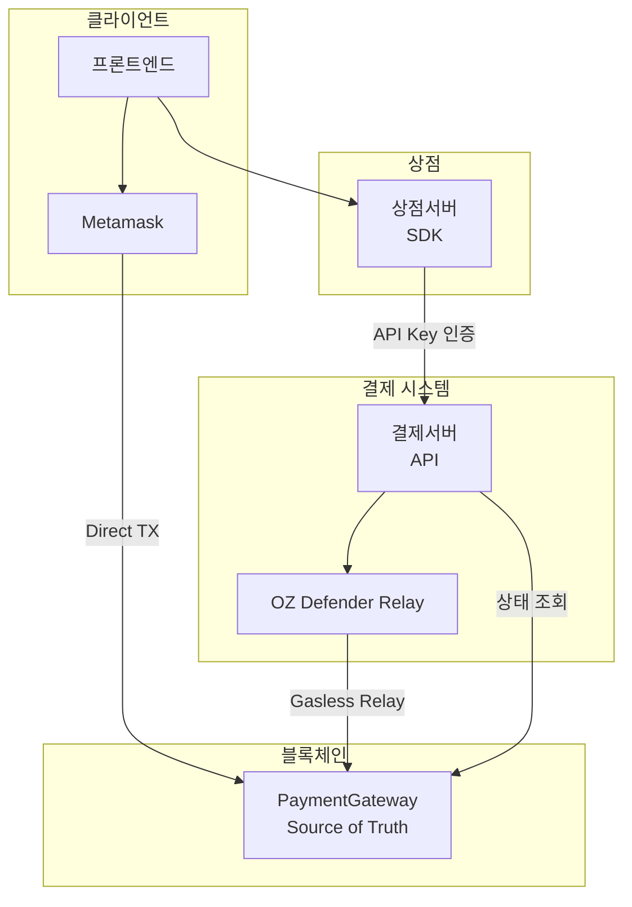
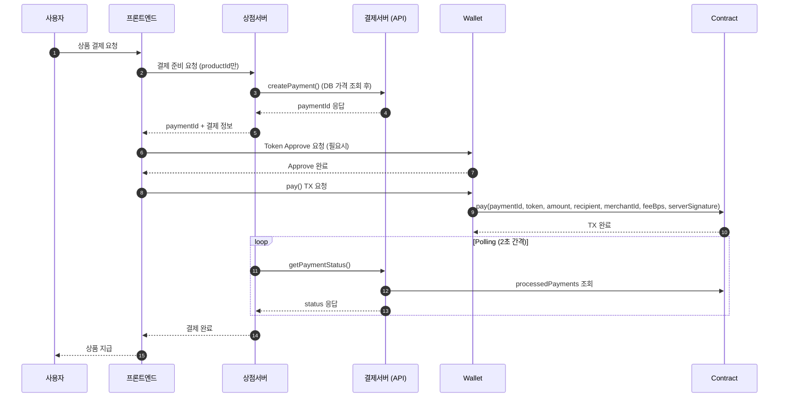
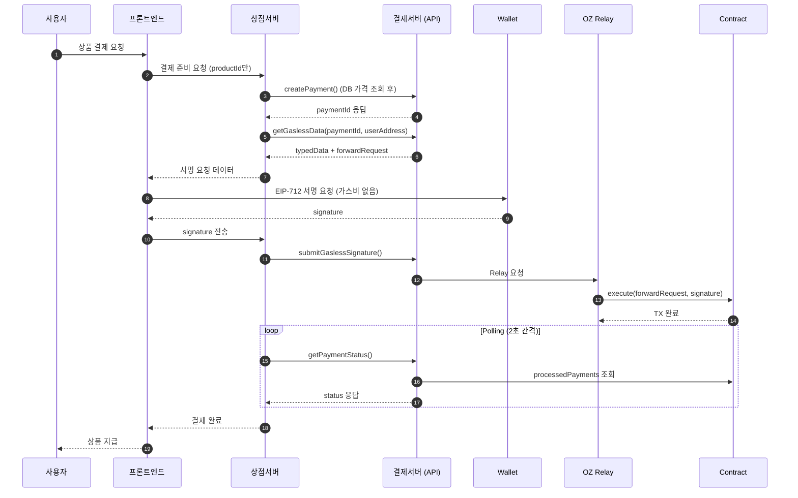
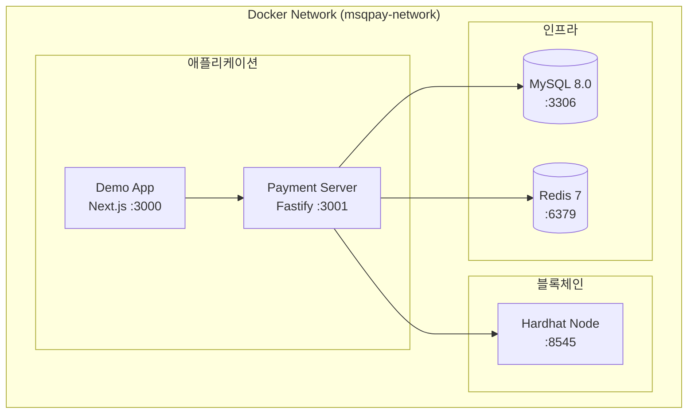
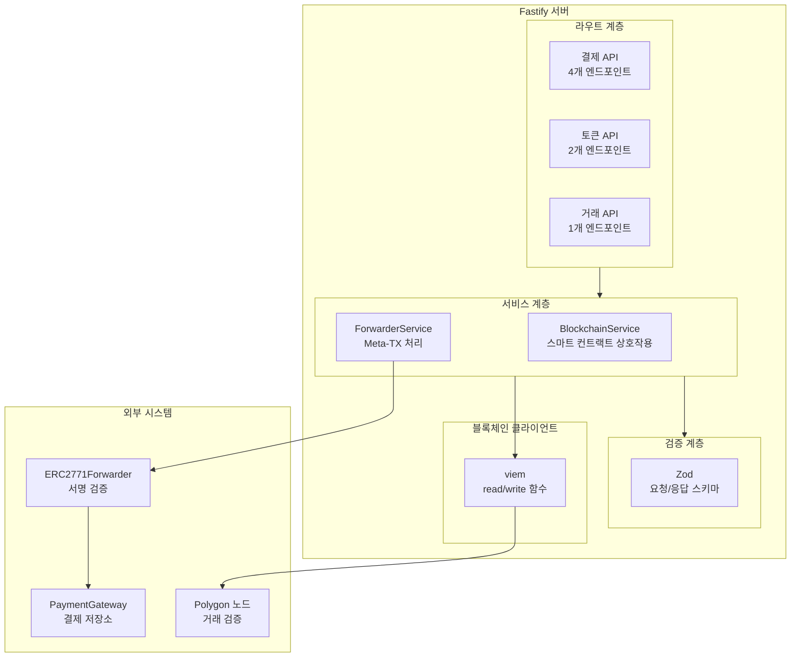

[English](architecture.md) | [한국어](architecture.ko.md)

# 시스템 구조

MSQPay 블록체인 결제 시스템의 전체 아키텍처 및 설계 원칙입니다.

## 핵심 원칙

| 원칙                                        | 설명                                                            |
| ------------------------------------------- | --------------------------------------------------------------- |
| **Contract = Source of Truth**              | 결제 완료 여부는 오직 스마트 컨트랙트만 신뢰                    |
| **Integrated DB Architecture**              | MySQL + Redis 캐싱 통합, 그러나 Contract = Source of Truth 유지 |
| **Consistent API Interface**                | MVP와 Production 모두 동일한 API 형태                           |
| **Server-Issued paymentId**                 | 결제서버가 유일한 paymentId 생성자                              |
| **Merchant Server ↔ Blockchain Separation** | 상점서버는 결제서버 API만 호출, 블록체인 직접 접근 불가         |

## 전체 시스템 다이어그램



## 결제 플로우

### Direct Payment

사용자가 가스비를 직접 지불하는 방식:



### Gasless Payment

서비스가 가스비를 대납하는 방식:



## Docker Compose 아키텍처 (로컬 개발)



### 서비스 구성

| 서비스  | 포트 | 설명          |
| ------- | ---- | ------------- |
| mysql   | 3306 | 결제 데이터   |
| redis   | 6379 | 캐싱          |
| hardhat | 8545 | 로컬 블록체인 |
| server  | 3001 | Payment API   |
| demo    | 3000 | 프론트엔드    |

## API 서버 구조

### Fastify 컨테이너 구조



## 스마트 컨트랙트 구조

### PaymentGatewayV1

```
PaymentGatewayV1 (UUPS Upgradeable)
├── Inheritance
│   ├── UUPSUpgradeable - 프록시 업그레이드
│   ├── OwnableUpgradeable - 소유권 관리
│   ├── ERC2771ContextUpgradeable - 가스리스 메타 트랜잭션 지원
│   ├── ReentrancyGuardUpgradeable - 재진입 방지
│   ├── EIP712Upgradeable - 서명 검증
│   └── IPaymentGateway - 인터페이스
├── Storage
│   ├── processedPayments: mapping(bytes32 => bool)
│   ├── supportedTokens: mapping(address => bool)
│   ├── enforceTokenWhitelist: bool
│   ├── treasuryAddress: address
│   └── signerAddress: address
├── Functions
│   ├── pay(paymentId, tokenAddress, amount, recipientAddress, merchantId, feeBps, serverSignature)
│   ├── setTreasury(newTreasuryAddress) - 트레저리 주소 변경 (owner only)
│   ├── setSigner(newSigner) - 서명자 주소 변경 (owner only)
│   ├── setSupportedToken(tokenAddress, supported) - 토큰 화이트리스트
│   ├── batchSetSupportedTokens(tokenAddresses[], supported[]) - 대량 토큰 화이트리스트
│   ├── setEnforceTokenWhitelist(enforce) - 화이트리스트 강제 여부
│   ├── isPaymentProcessed(paymentId) - 결제 상태 확인
│   ├── getTrustedForwarder() - ERC2771 포워더 조회
│   ├── getDomainSeparator() - EIP-712 도메인 분리자 조회
│   └── _authorizeUpgrade() - 업그레이드 승인 (owner only)
└── Events
    ├── PaymentCompleted(paymentId, merchantId, payerAddress, recipientAddress, tokenAddress, amount, fee, timestamp)
    ├── TreasuryChanged(oldTreasuryAddress, newTreasuryAddress)
    ├── SignerChanged(oldSigner, newSigner)
    └── TokenSupportChanged(tokenAddress, supported)
```

### 결제 플로우 (컨트랙트 레벨)

```
1. 사용자가 7개의 파라미터로 pay() 호출
2. 컨트랙트가 서버 EIP-712 서명 검증
3. 컨트랙트가 수수료 계산: feeAmount = (amount * feeBps) / 10000
4. 컨트랙트가 수수료를 treasuryAddress로 전송
5. 컨트랙트가 (amount - fee)를 recipientAddress로 전송
6. 컨트랙트가 paymentId를 처리됨으로 표시
7. 컨트랙트가 PaymentCompleted 이벤트 발행
```

### ERC2771Forwarder

```
ERC2771Forwarder
├── Storage
│   └── nonces: mapping(address => uint256)
├── Functions
│   ├── execute() - Execute Meta-TX
│   ├── verify() - Verify EIP-712 signature
│   └── getNonce() - Get user nonce
└── EIP-712 Types
    └── ForwardRequest(from, to, value, gas, nonce, deadline, data)
```

## paymentId 생성

결제서버에서 Node.js로 생성 (스마트 컨트랙트 아님):

```typescript
import { keccak256, toHex } from 'viem';
import { randomBytes } from 'crypto';

function generatePaymentId(merchantId: string): `0x${string}` {
  const random = randomBytes(32);
  return keccak256(toHex(`${merchantId}:${Date.now()}:${random.toString('hex')}`));
}
```

**특징**:

- merchantId + timestamp + random bytes 기반 생성
- orderId는 server-to-server 아키텍처에서 불필요
- 상점은 paymentId를 내부 주문과 매핑할 수 있음
- merchantId 포함 → 상점간 충돌 불가
- randomBytes 포함 → 항상 고유한 paymentId

## 보안 설계

### 클라이언트 조작 방지

| 위협                   | 대응                                                      |
| ---------------------- | --------------------------------------------------------- |
| 가짜 paymentId 생성    | 결제서버만 paymentId 발급                                 |
| 결제 완료 위조         | Contract에서 직접 조회                                    |
| **금액 조작 (Direct)** | **상점서버에서 상품 가격 조회 (프론트 amount 수신 금지)** |
| 금액 조작 (Gasless)    | 서명 데이터에서 amount 확인                               |
| 상점 위장              | API Key 인증                                              |
| 수수료/수신자 조작     | 컨트랙트에서 서버 EIP-712 서명 검증                       |

**핵심 보안 원칙**: 프론트엔드는 `productId`만 전송하고, 상점서버가 DB/설정에서 실제 가격을 조회하여 결제서버에 전달해야 합니다.

**서버 서명 보안**: 모든 결제 파라미터(금액, 수신자, 수수료)는 서버가 EIP-712를 사용하여 서명합니다. 컨트랙트는 처리 전에 이 서명을 검증하여 중요한 결제 데이터의 클라이언트 측 조작을 방지합니다.

### 컨트랙트 보안

| 위험                 | 대응                                     |
| -------------------- | ---------------------------------------- |
| Reentrancy           | ReentrancyGuard 적용                     |
| Replay Attack        | processedPayments로 중복 방지            |
| Meta-tx Replay       | Forwarder nonce + deadline               |
| Unauthorized Upgrade | onlyOwner modifier on \_authorizeUpgrade |

### SDK/API 보안

| 위험               | 대응                            |
| ------------------ | ------------------------------- |
| Invalid Payment ID | Hash order ID로 고유성 보장     |
| Signature Reuse    | nonce + deadline 포함           |
| Man-in-the-middle  | HTTPS only                      |
| Rate Limiting      | 10 req/s per client (향후 적용) |

## 네트워크 설정

### Polygon Amoy Testnet

| 항목           | 값                                  |
| -------------- | ----------------------------------- |
| Chain ID       | 80002                               |
| Name           | Polygon Amoy Testnet                |
| RPC URL        | https://rpc-amoy.polygon.technology |
| Block Explorer | https://amoy.polygonscan.com        |

### 배포된 컨트랙트

| Contract                | Address                                      |
| ----------------------- | -------------------------------------------- |
| PaymentGateway (Proxy)  | `0x57F7E705d10e0e94DFB880fFaf58064210bAaf8d` |
| PaymentGatewayV1 (Impl) | `0x6b08b0EaD9370605AC9F34A17897515aACa0954a` |
| ERC2771Forwarder        | `0xF034a404241707F347A952Cd4095f9035AF877Bf` |
| SUT Token               | `0xE4C687167705Abf55d709395f92e254bdF5825a2` |

## 확장성

### Production 아키텍처 (향후)

Production 환경에서는 API Server와 Status Worker를 분리:

| 서버              | 역할                                  | Stateless |
| ----------------- | ------------------------------------- | --------- |
| **API Server**    | 외부 요청 처리, 결제 생성, Relay      | O         |
| **Status Worker** | 블록체인 이벤트 모니터링, 상태 동기화 | X         |

**확장 방식**:

| 구성요소      | 확장 방식                        |
| ------------- | -------------------------------- |
| API Server    | 수평 확장 (로드밸런서)           |
| Status Worker | 단일 인스턴스 (이벤트 중복 방지) |
| MySQL         | Read Replica                     |
| Redis         | Cluster 모드                     |

## 기술 스택

| 구성요소             | 기술                                      |
| -------------------- | ----------------------------------------- |
| Smart Contract       | Solidity 0.8.24, OpenZeppelin 5.x         |
| Contract Framework   | Hardhat                                   |
| Payment Server       | Node.js, Fastify v5, viem v2.21           |
| Payment Server Tests | Vitest, Pino structured logging           |
| SDK                  | TypeScript, Node 18+ native fetch         |
| SDK Tests            | Vitest, 100% coverage                     |
| Relay                | Simple Relayer (dev) / OZ Defender (prod) |
| Demo App             | Next.js 14, wagmi, RainbowKit             |
| Package Manager      | pnpm                                      |

## 관련 문서

- [API 레퍼런스](api.ko.md) - 모든 API 엔드포인트
- [SDK 레퍼런스](sdk.ko.md) - MSQPayClient 메서드
- [결제 통합하기](../guides/integrate-payment.ko.md) - SDK 사용법
- [서버 배포하기](../guides/deploy-server.ko.md) - 배포 가이드
