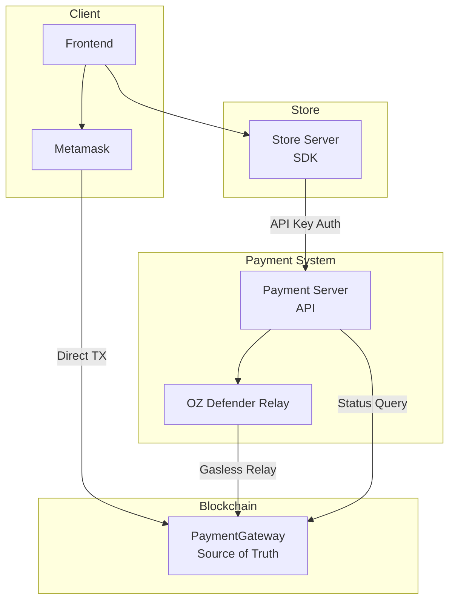
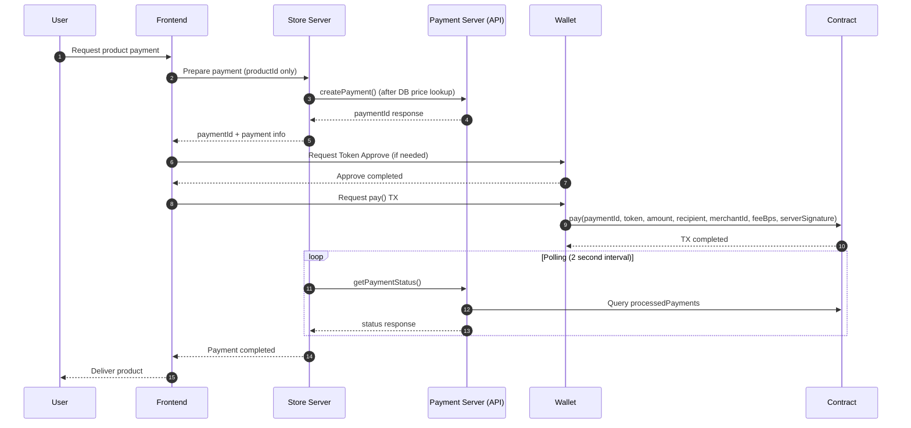
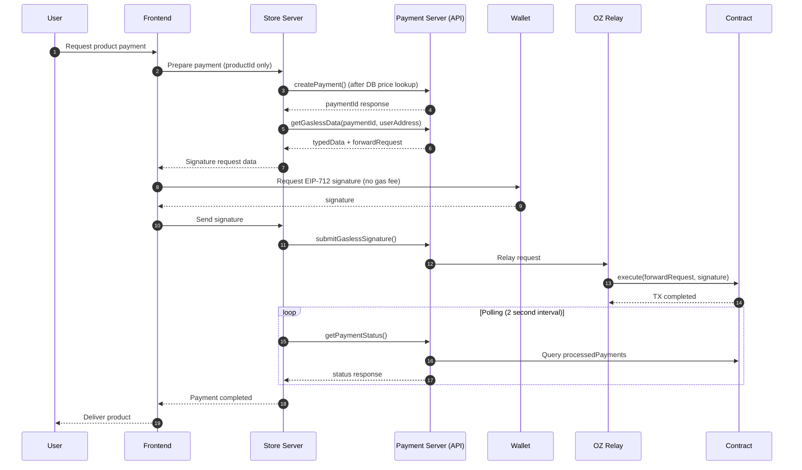
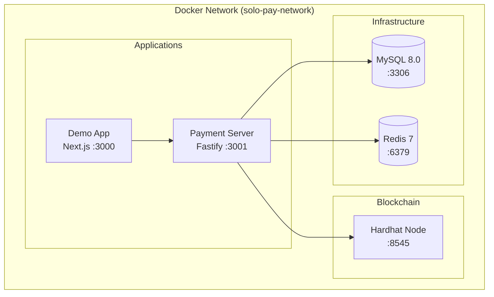
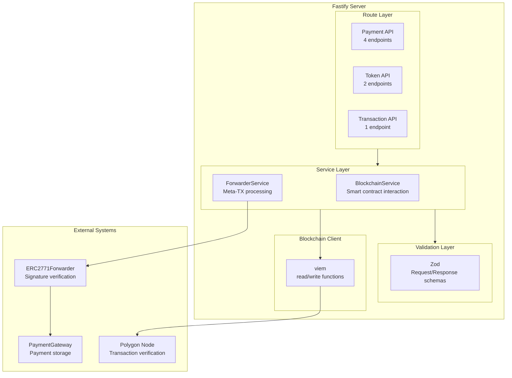

[English](architecture.md) | [한국어](architecture.ko.md)

# System Architecture

Complete architecture and design principles of the SoloPay blockchain payment system.

## Core Principles

| Principle                                   | Description                                                                     |
| ------------------------------------------- | ------------------------------------------------------------------------------- |
| **Contract = Source of Truth**              | Payment completion is only trusted from the smart contract                      |
| **Integrated DB Architecture**              | MySQL + Redis caching integration, while maintaining Contract = Source of Truth |
| **Consistent API Interface**                | Same API format for both MVP and Production                                     |
| **Server-Issued paymentId**                 | Payment server is the sole generator of paymentId                               |
| **Merchant Server ↔ Blockchain Separation** | Store servers only call Payment Server API, no direct blockchain access         |

## Complete System Diagram



## Payment Flows

### Direct Payment

Users pay gas fees directly:



### Gasless Payment

Service subsidizes gas fees:



## Docker Compose Architecture (Local Development)



### Service Configuration

| Service | Port | Description      |
| ------- | ---- | ---------------- |
| mysql   | 3306 | Payment data     |
| redis   | 6379 | Caching          |
| hardhat | 8545 | Local blockchain |
| server  | 3001 | Payment API      |
| demo    | 3000 | Frontend         |

## API Server Structure

### Fastify Container Structure



## Smart Contract Structure

### PaymentGatewayV1

```
PaymentGatewayV1 (UUPS Upgradeable)
├── Inheritance
│   ├── UUPSUpgradeable - Proxy upgradability
│   ├── OwnableUpgradeable - Ownership management
│   ├── ERC2771ContextUpgradeable - Gasless meta-transaction support
│   ├── ReentrancyGuardUpgradeable - Reentrancy protection
│   ├── EIP712Upgradeable - Signature verification
│   └── IPaymentGateway - Interface
├── Storage
│   ├── processedPayments: mapping(bytes32 => bool)
│   ├── supportedTokens: mapping(address => bool)
│   ├── enforceTokenWhitelist: bool
│   ├── treasuryAddress: address
│   └── signerAddress: address
├── Functions
│   ├── pay(paymentId, tokenAddress, amount, recipientAddress, merchantId, feeBps, serverSignature)
│   ├── setTreasury(newTreasuryAddress) - Update treasury (owner only)
│   ├── setSigner(newSigner) - Update signer (owner only)
│   ├── setSupportedToken(tokenAddress, supported) - Token whitelist
│   ├── batchSetSupportedTokens(tokenAddresses[], supported[]) - Bulk token whitelist
│   ├── setEnforceTokenWhitelist(enforce) - Toggle whitelist enforcement
│   ├── isPaymentProcessed(paymentId) - Check payment status
│   ├── getTrustedForwarder() - Get ERC2771 forwarder
│   ├── getDomainSeparator() - Get EIP-712 domain separator
│   └── _authorizeUpgrade() - Upgrade authorization (owner only)
└── Events
    ├── PaymentCompleted(paymentId, merchantId, payerAddress, recipientAddress, tokenAddress, amount, fee, timestamp)
    ├── TreasuryChanged(oldTreasuryAddress, newTreasuryAddress)
    ├── SignerChanged(oldSigner, newSigner)
    └── TokenSupportChanged(tokenAddress, supported)
```

### Payment Flow (Contract Level)

```
1. User calls pay() with 7 parameters
2. Contract verifies server EIP-712 signature
3. Contract calculates fee: feeAmount = (amount * feeBps) / 10000
4. Contract transfers fee to treasuryAddress
5. Contract transfers (amount - fee) to recipientAddress
6. Contract marks paymentId as processed
7. Contract emits PaymentCompleted event
```

### ERC2771Forwarder

```
ERC2771Forwarder
├── Storage
│   └── nonces: mapping(address => uint256)
├── Functions
│   ├── execute() - Execute Meta-TX
│   ├── verify() - Verify EIP-712 signature
│   └── getNonce() - Get user nonce
└── EIP-712 Types
    └── ForwardRequest(from, to, value, gas, nonce, deadline, data)
```

## paymentId Generation

Generated by Payment Server using Node.js (not smart contract):

```typescript
import { keccak256, toHex } from 'viem';
import { randomBytes } from 'crypto';

function generatePaymentId(merchantId: string): `0x${string}` {
  const random = randomBytes(32);
  return keccak256(toHex(`${merchantId}:${Date.now()}:${random.toString('hex')}`));
}
```

**Characteristics**:

- Generated from merchantId + timestamp + random bytes
- orderId is not required in server-to-server architecture
- Merchant can map paymentId to their internal order themselves
- Includes merchantId → No collision between merchants
- Includes randomBytes → Always unique paymentId

## Security Design

### Client Manipulation Prevention

| Threat                           | Countermeasure                                                         |
| -------------------------------- | ---------------------------------------------------------------------- |
| Fake paymentId generation        | Only Payment Server issues paymentId                                   |
| Payment completion forgery       | Query directly from Contract                                           |
| **Amount Manipulation (Direct)** | **Store server queries product price (no frontend amount acceptance)** |
| Amount Manipulation (Gasless)    | Verify amount in signature data                                        |
| Store impersonation              | API Key authentication                                                 |
| Fee/Recipient Manipulation       | Server EIP-712 signature verification in contract                      |

**Core Security Principle**: Frontend sends only `productId`, and store server must query actual price from DB/config and pass to Payment Server.

**Server Signature Security**: All payment parameters (amount, recipient, fee) are signed by the server using EIP-712. The contract verifies this signature before processing, preventing any client-side manipulation of critical payment data.

### Contract Security

| Risk                 | Countermeasure                            |
| -------------------- | ----------------------------------------- |
| Reentrancy           | ReentrancyGuard applied                   |
| Replay Attack        | Prevent duplicates with processedPayments |
| Meta-tx Replay       | Forwarder nonce + deadline                |
| Unauthorized Upgrade | onlyOwner modifier on \_authorizeUpgrade  |

### SDK/API Security

| Risk               | Countermeasure                              |
| ------------------ | ------------------------------------------- |
| Invalid Payment ID | Guarantee uniqueness with hash order ID     |
| Signature Reuse    | Include nonce + deadline                    |
| Man-in-the-middle  | HTTPS only                                  |
| Rate Limiting      | 10 req/s per client (future implementation) |

## Network Configuration

### Polygon Amoy Testnet

| Item           | Value                               |
| -------------- | ----------------------------------- |
| Chain ID       | 80002                               |
| Name           | Polygon Amoy Testnet                |
| RPC URL        | https://rpc-amoy.polygon.technology |
| Block Explorer | https://amoy.polygonscan.com        |

### Deployed Contracts

| Contract                | Address                                      |
| ----------------------- | -------------------------------------------- |
| PaymentGateway (Proxy)  | `0x57F7E705d10e0e94DFB880fFaf58064210bAaf8d` |
| PaymentGatewayV1 (Impl) | `0x6b08b0EaD9370605AC9F34A17897515aACa0954a` |
| ERC2771Forwarder        | `0xE8a3C8e530dddd14e02DA1C81Df6a15f41ad78DE` |
| SUT Token               | `0xE4C687167705Abf55d709395f92e254bdF5825a2` |

## Scalability

### Production Architecture (Future)

In production environment, separate API Server and Status Worker:

| Server            | Role                                              | Stateless |
| ----------------- | ------------------------------------------------- | --------- |
| **API Server**    | Handle external requests, payment creation, relay | O         |
| **Status Worker** | Monitor blockchain events, sync status            | X         |

**Scaling Strategy**:

| Component     | Scaling Method                              |
| ------------- | ------------------------------------------- |
| API Server    | Horizontal scaling (load balancer)          |
| Status Worker | Single instance (prevent event duplication) |
| MySQL         | Read Replica                                |
| Redis         | Cluster mode                                |

## Technology Stack

| Component            | Technology                                |
| -------------------- | ----------------------------------------- |
| Smart Contract       | Solidity 0.8.24, OpenZeppelin 5.x         |
| Contract Framework   | Hardhat                                   |
| Payment Server       | Node.js, Fastify v5, viem v2.21           |
| Payment Server Tests | Vitest, Pino structured logging           |
| SDK                  | TypeScript, Node 18+ native fetch         |
| SDK Tests            | Vitest, 100% coverage                     |
| Relay                | Simple Relayer (dev) / OZ Defender (prod) |
| Demo App             | Next.js 14, wagmi, RainbowKit             |
| Package Manager      | pnpm                                      |

## Related Documentation

- [API Reference](api.md) - All API endpoints
- [SDK Reference](sdk.md) - SoloPayClient methods
- [Integrate Payment](../guides/integrate-payment.md) - SDK usage
- [Deploy Server](../guides/deploy-server.md) - Deployment guide
