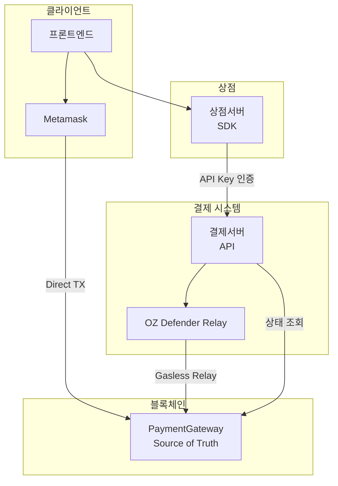

# Technical Specification
## MSQ Pay Onchain - Implementation Details

### Document Information
- **Version**: 1.0
- **Date**: 2025-11-27
- **Status**: Approved

---

## 1. 시스템 아키텍처

### 1.1 전체 구성



### 1.2 MVP 특징

- **Stateless**: DB/Redis 없음
- **Contract = Source of Truth**: 결제 상태는 Contract에서 직접 조회
- **동일 API 인터페이스**: MVP와 Production 간 호환

---

## 2. 결제서버 API

### 2.1 인증

모든 API 요청에 API Key 필요:

```
Headers:
  x-api-key: sk_test_abc123
```

### 2.2 결제 생성

```
POST /payments/create
```

**Request**:
```typescript
{
  orderId: string;        // 상점의 주문 ID
  amount: string;         // 결제 금액 (wei 단위 문자열)
  token: Address;         // 토큰 컨트랙트 주소
  merchant: Address;      // 수취인 지갑 주소
}
```

**Response**:
```typescript
{
  paymentId: string;      // bytes32 hex string
  orderId: string;
  amount: string;
  token: Address;
  merchant: Address;
  status: "pending";
}
```

**MVP 동작**:
- paymentId 생성 (keccak256 + randomBytes)
- 응답 반환 (DB 저장 없음)

**Production 동작**:
- paymentId 생성
- DB 저장
- 응답 반환

### 2.3 결제 상태 조회

```
GET /payments/:paymentId/status
```

**Response**:
```typescript
{
  paymentId: string;
  status: "pending" | "completed";
}
```

**MVP 동작**:
```typescript
const isProcessed = await contract.read.processedPayments([paymentId]);
return { paymentId, status: isProcessed ? 'completed' : 'pending' };
```

**Production 동작**:
```typescript
// DB에서 조회 + Contract 확인 + 금액 검증
const dbPayment = await db.payments.findByPaymentId(paymentId);
const isProcessed = await contract.read.processedPayments([paymentId]);
// 추가 검증 로직...
```

### 2.4 Gasless 데이터 조회

```
GET /payments/:paymentId/gasless?userAddress=0x...
```

**Response**:
```typescript
{
  nonce: string;
  forwardRequest: {
    from: Address;        // userAddress
    to: Address;          // gateway 주소
    value: "0";
    gas: string;
    nonce: string;
    deadline: string;
    data: string;         // encoded pay() call
  };
  typedData: {
    domain: EIP712Domain;
    types: EIP712Types;
    primaryType: string;
    message: ForwardRequest;
  };
}
```

**동작**:
1. Forwarder Contract에서 nonce 조회
2. ForwardRequest 구성
3. EIP-712 typedData 생성
4. 응답 반환

### 2.5 Gasless 릴레이

```
POST /payments/:paymentId/relay
```

**Request**:
```typescript
{
  signature: string;      // EIP-712 서명 (hex)
  forwardRequest: {
    from: Address;
    to: Address;
    value: string;
    gas: string;
    nonce: string;
    deadline: string;
    data: string;
  };
}
```

**Response**:
```typescript
{
  txHash: string;
  status: "submitted";
}
```

**동작**:
1. 서명 검증
2. OZ Defender Relay 호출
3. txHash 반환

---

## 3. paymentId 생성

### 3.1 알고리즘

```typescript
import { keccak256, toBytes, concat } from 'viem';
import { randomBytes } from 'crypto';

function generatePaymentId(storeId: string, orderId: string): `0x${string}` {
  return keccak256(
    concat([
      toBytes(storeId),      // API Key에서 추출
      toBytes(orderId),      // 상점서버 요청
      randomBytes(32)        // 매번 다른 ID 보장
    ])
  );
}
```

### 3.2 특징

| 특징 | 설명 |
|------|------|
| 유일성 | randomBytes로 항상 다른 ID |
| 상점 구분 | storeId 포함으로 상점간 충돌 방지 |
| 추적성 | orderId 포함으로 주문 연결 가능 |
| 서버 생성 | 클라이언트 조작 불가 |

---

## 4. API Key 관리

### 4.1 MVP: 환경변수

```bash
# .env
STORE_API_KEYS='{
  "sk_test_abc123": { "storeId": "store_001", "name": "Demo Store" },
  "sk_test_def456": { "storeId": "store_002", "name": "Test Shop" }
}'
```

```typescript
function validateApiKey(apiKey: string): StoreInfo | null {
  const stores = JSON.parse(process.env.STORE_API_KEYS || '{}');
  return stores[apiKey] || null;
}

// 미들웨어
function authMiddleware(req, res, next) {
  const apiKey = req.headers['x-api-key'];
  const store = validateApiKey(apiKey);

  if (!store) {
    return res.status(401).json({ error: 'Invalid API Key' });
  }

  req.store = store;
  next();
}
```

### 4.2 Production: DB

```sql
CREATE TABLE stores (
  id VARCHAR(36) PRIMARY KEY,
  api_key VARCHAR(64) UNIQUE NOT NULL,
  name VARCHAR(255) NOT NULL,
  webhook_url VARCHAR(512),
  is_active BOOLEAN DEFAULT true,
  created_at TIMESTAMP DEFAULT NOW(),
  updated_at TIMESTAMP DEFAULT NOW()
);

CREATE INDEX idx_stores_api_key ON stores(api_key);
```

### 4.3 API Key 형식

```
sk_test_[random32chars]  -- 테스트용
sk_live_[random32chars]  -- 프로덕션용
```

```typescript
import { randomBytes } from 'crypto';

function generateApiKey(isTest: boolean): string {
  const prefix = isTest ? 'sk_test_' : 'sk_live_';
  return prefix + randomBytes(16).toString('hex');
}
```

---

## 5. Smart Contract

### 5.1 Contract Overview

```
┌─────────────────────┐
│   ERC1967Proxy      │
│   (Upgradeable)     │
└──────────┬──────────┘
           │ delegates to
           ▼
┌─────────────────────┐
│  PaymentGatewayV1   │
│  - processedPayments│
│  - supportedTokens  │
│  - pay()            │
└─────────────────────┘
           │ inherits
           ▼
┌─────────────────────────────────────────┐
│ UUPSUpgradeable                         │
│ OwnableUpgradeable                      │
│ ERC2771ContextUpgradeable               │
│ ReentrancyGuardUpgradeable              │
└─────────────────────────────────────────┘
```

### 5.2 Storage Layout

```solidity
contract PaymentGatewayV1Storage {
    // 결제 완료 기록 (Source of Truth)
    mapping(bytes32 => bool) public processedPayments;

    // 지원 토큰 목록
    mapping(address => bool) public supportedTokens;

    // 업그레이드용 gap
    uint256[49] private __gap;
}
```

### 5.3 Events

```solidity
event PaymentCompleted(
    bytes32 indexed paymentId,
    address indexed payer,
    address indexed merchant,
    address token,
    uint256 amount,
    uint256 timestamp
);

event TokenSupportChanged(
    address indexed token,
    bool supported
);
```

### 5.4 Core Function

```solidity
function pay(
    bytes32 paymentId,
    address token,
    uint256 amount,
    address merchant
) external nonReentrant {
    require(!processedPayments[paymentId], "Payment already processed");
    require(supportedTokens[token], "Token not supported");
    require(amount > 0, "Amount must be greater than 0");
    require(merchant != address(0), "Invalid merchant");

    processedPayments[paymentId] = true;

    // _msgSender() = 실제 사용자 (Meta-tx 지원)
    IERC20(token).safeTransferFrom(_msgSender(), merchant, amount);

    emit PaymentCompleted(
        paymentId,
        _msgSender(),
        merchant,
        token,
        amount,
        block.timestamp
    );
}
```

---

## 6. Meta Transaction (ERC-2771)

### 6.1 Flow

```
User (Signer)
    │
    │ 1. Sign EIP-712 ForwardRequest
    ▼
Payment Server
    │
    │ 2. Verify signature
    │ 3. Submit to OZ Defender
    ▼
ERC2771Forwarder
    │
    │ 4. Forward call with original signer
    ▼
PaymentGateway
    │
    │ _msgSender() returns original signer
    ▼
Token Transfer
```

### 6.2 EIP-712 Domain

```typescript
const domain = {
  name: "ERC2771Forwarder",
  version: "1",
  chainId: 80002,  // Polygon Amoy
  verifyingContract: FORWARDER_ADDRESS
};
```

### 6.3 ForwardRequest Types

```typescript
const types = {
  ForwardRequest: [
    { name: "from", type: "address" },
    { name: "to", type: "address" },
    { name: "value", type: "uint256" },
    { name: "gas", type: "uint256" },
    { name: "nonce", type: "uint256" },
    { name: "deadline", type: "uint48" },
    { name: "data", type: "bytes" }
  ]
};
```

### 6.4 OZ Defender Integration

```typescript
import { Defender } from '@openzeppelin/defender-sdk';

const client = new Defender({
  apiKey: process.env.OZ_DEFENDER_API_KEY,
  apiSecret: process.env.OZ_DEFENDER_API_SECRET
});

async function relayTransaction(
  forwardRequest: ForwardRequest,
  signature: string
): Promise<string> {
  const relayer = client.relaySigner.getRelayer(process.env.RELAYER_ID);

  const tx = await relayer.sendTransaction({
    to: FORWARDER_ADDRESS,
    data: encodeForwarderExecute(forwardRequest, signature),
    gasLimit: 500000
  });

  return tx.hash;
}
```

---

## 7. SDK (`@globalmsq/msqpay`)

### 7.1 Configuration

```typescript
type Environment = 'development' | 'staging' | 'production' | 'custom';

interface MSQPayConfig {
  environment: Environment;
  apiKey: string;
  customApiUrl?: string;  // environment가 'custom'일 때만
}

const API_URLS: Record<Exclude<Environment, 'custom'>, string> = {
  development: 'http://localhost:3001',
  staging: 'https://pay-api.staging.msq.com',
  production: 'https://pay-api.msq.com'
};
```

### 7.2 Class Interface

```typescript
class MSQPayClient {
  private apiUrl: string;
  private apiKey: string;
  private http: AxiosInstance;

  constructor(config: MSQPayConfig);

  // URL 관리 (custom용)
  setApiUrl(url: string): void;
  getApiUrl(): string;

  // 결제 생성
  createPayment(params: CreatePaymentParams): Promise<Payment>;

  // 상태 조회
  getPaymentStatus(paymentId: string): Promise<PaymentStatus>;

  // Gasless
  getGaslessData(paymentId: string, userAddress: string): Promise<GaslessData>;
  submitGaslessSignature(
    paymentId: string,
    signature: string,
    forwardRequest: ForwardRequest
  ): Promise<RelayResult>;
}
```

### 7.3 Type Definitions

```typescript
interface CreatePaymentParams {
  orderId: string;
  amount: string;           // wei 단위
  token: `0x${string}`;     // 토큰 주소
  merchant: `0x${string}`;  // 수취인 주소
}

interface Payment {
  paymentId: `0x${string}`;
  orderId: string;
  amount: string;
  token: `0x${string}`;
  merchant: `0x${string}`;
  status: 'pending' | 'completed';
}

interface PaymentStatus {
  paymentId: `0x${string}`;
  status: 'pending' | 'completed';
}

interface ForwardRequest {
  from: `0x${string}`;
  to: `0x${string}`;
  value: string;
  gas: string;
  nonce: string;
  deadline: string;
  data: `0x${string}`;
}

interface GaslessData {
  nonce: string;
  forwardRequest: ForwardRequest;
  typedData: TypedData;
}

interface RelayResult {
  txHash: `0x${string}`;
  status: 'submitted' | 'confirmed' | 'failed';
}
```

### 7.4 Implementation

```typescript
import axios, { AxiosInstance } from 'axios';

const API_URLS = {
  development: 'http://localhost:3001',
  staging: 'https://pay-api.staging.msq.com',
  production: 'https://pay-api.msq.com'
};

export class MSQPayClient {
  private apiUrl: string;
  private apiKey: string;
  private http: AxiosInstance;

  constructor(config: MSQPayConfig) {
    this.apiKey = config.apiKey;

    if (config.environment === 'custom') {
      if (!config.customApiUrl) {
        throw new Error('customApiUrl is required when environment is "custom"');
      }
      this.apiUrl = config.customApiUrl;
    } else {
      this.apiUrl = API_URLS[config.environment];
    }

    this.http = axios.create({
      baseURL: this.apiUrl,
      headers: { 'x-api-key': this.apiKey }
    });
  }

  setApiUrl(url: string): void {
    this.apiUrl = url;
    this.http.defaults.baseURL = url;
  }

  getApiUrl(): string {
    return this.apiUrl;
  }

  async createPayment(params: CreatePaymentParams): Promise<Payment> {
    const { data } = await this.http.post('/payments/create', params);
    return data;
  }

  async getPaymentStatus(paymentId: string): Promise<PaymentStatus> {
    const { data } = await this.http.get(`/payments/${paymentId}/status`);
    return data;
  }

  async getGaslessData(paymentId: string, userAddress: string): Promise<GaslessData> {
    const { data } = await this.http.get(
      `/payments/${paymentId}/gasless?userAddress=${userAddress}`
    );
    return data;
  }

  async submitGaslessSignature(
    paymentId: string,
    signature: string,
    forwardRequest: ForwardRequest
  ): Promise<RelayResult> {
    const { data } = await this.http.post(`/payments/${paymentId}/relay`, {
      signature,
      forwardRequest
    });
    return data;
  }
}
```

### 7.5 Usage Example

```typescript
import { MSQPayClient } from '@globalmsq/msqpay';

// 초기화
const client = new MSQPayClient({
  environment: 'development',
  apiKey: 'sk_test_abc123'
});

// Direct Payment Flow
async function directPayment(orderId: string, amount: string) {
  // 1. 결제 생성
  const payment = await client.createPayment({
    orderId,
    amount,
    token: '0xE4C687167705Abf55d709395f92e254bdF5825a2',
    merchant: '0x...'
  });

  // 2. 프론트에 payment 정보 전달
  // 3. 프론트에서 Metamask TX 실행
  // 4. 상태 polling
  let status = await client.getPaymentStatus(payment.paymentId);
  while (status.status === 'pending') {
    await sleep(2000);
    status = await client.getPaymentStatus(payment.paymentId);
  }

  return status;
}

// Gasless Payment Flow
async function gaslessPayment(orderId: string, amount: string, userAddress: string) {
  // 1. 결제 생성
  const payment = await client.createPayment({
    orderId,
    amount,
    token: '0xE4C687167705Abf55d709395f92e254bdF5825a2',
    merchant: '0x...'
  });

  // 2. Gasless 데이터 조회
  const gaslessData = await client.getGaslessData(payment.paymentId, userAddress);

  // 3. 프론트에 typedData 전달 → 서명 받기
  // 4. 서명 제출
  const result = await client.submitGaslessSignature(
    payment.paymentId,
    signature,  // 프론트에서 받은 서명
    gaslessData.forwardRequest
  );

  // 5. 상태 확인
  const status = await client.getPaymentStatus(payment.paymentId);
  return status;
}
```

---

## 8. 프론트엔드 샘플 코드

### 8.1 Direct Payment

```typescript
import { useWriteContract, useWaitForTransactionReceipt } from 'wagmi';
import { parseUnits } from 'viem';

function DirectPayment({ payment }) {
  const { writeContract, data: hash } = useWriteContract();
  const { isSuccess } = useWaitForTransactionReceipt({ hash });

  const handlePay = async () => {
    await writeContract({
      address: GATEWAY_ADDRESS,
      abi: PaymentGatewayABI,
      functionName: 'pay',
      args: [
        payment.paymentId,
        payment.token,
        BigInt(payment.amount),
        payment.merchant
      ]
    });
  };

  return (
    <button onClick={handlePay}>
      {isSuccess ? '결제 완료' : '결제하기'}
    </button>
  );
}
```

### 8.2 Gasless Payment

```typescript
import { useSignTypedData } from 'wagmi';

function GaslessPayment({ typedData, onSign }) {
  const { signTypedData } = useSignTypedData();

  const handleSign = async () => {
    const signature = await signTypedData({
      domain: typedData.domain,
      types: typedData.types,
      primaryType: typedData.primaryType,
      message: typedData.message
    });

    // 서명을 상점서버로 전송
    onSign(signature);
  };

  return (
    <button onClick={handleSign}>
      서명하기 (가스비 무료)
    </button>
  );
}
```

### 8.3 Approve (토큰당 1회)

```typescript
import { useWriteContract, useReadContract } from 'wagmi';
import { maxUint256 } from 'viem';

function TokenApprove({ token, gateway }) {
  const { data: allowance } = useReadContract({
    address: token,
    abi: erc20Abi,
    functionName: 'allowance',
    args: [userAddress, gateway]
  });

  const { writeContract } = useWriteContract();

  const needsApprove = !allowance || allowance === 0n;

  const handleApprove = async () => {
    await writeContract({
      address: token,
      abi: erc20Abi,
      functionName: 'approve',
      args: [gateway, maxUint256]
    });
  };

  if (!needsApprove) return null;

  return (
    <button onClick={handleApprove}>
      토큰 승인 (1회만)
    </button>
  );
}
```

---

## 9. Network Configuration

### 9.1 Polygon Amoy Testnet

```typescript
export const POLYGON_AMOY = {
  chainId: 80002,
  name: "Polygon Amoy Testnet",
  network: "polygon-amoy",
  nativeCurrency: {
    name: "MATIC",
    symbol: "MATIC",
    decimals: 18
  },
  rpcUrls: {
    default: {
      http: ["https://rpc-amoy.polygon.technology"],
      webSocket: ["wss://rpc-amoy.polygon.technology"]
    }
  },
  blockExplorers: {
    default: {
      name: "PolygonScan",
      url: "https://amoy.polygonscan.com"
    }
  },
  testnet: true
};
```

### 9.2 Contract Addresses

```typescript
export const CONTRACTS = {
  POLYGON_AMOY: {
    forwarder: "0x...",      // ERC2771Forwarder
    gateway: "0x...",        // PaymentGateway Proxy
  }
};

export const TOKENS = {
  POLYGON_AMOY: {
    SUT: "0xE4C687167705Abf55d709395f92e254bdF5825a2"
  }
};
```

---

## 10. Gas Estimates

| Operation | Estimated Gas |
|-----------|---------------|
| Direct Payment | ~65,000 |
| Meta-tx Payment (via Forwarder) | ~85,000 |
| Token Approval (1회) | ~46,000 |

---

## 11. Error Handling

### 11.1 Error Codes

| Code | Description |
|------|-------------|
| `UNAUTHORIZED` | API Key 인증 실패 |
| `INVALID_PAYMENT_ID` | 유효하지 않은 paymentId 형식 |
| `INVALID_SIGNATURE` | EIP-712 서명 검증 실패 |
| `RELAY_FAILED` | OZ Defender Relay 실패 |
| `CONTRACT_ERROR` | Contract 호출 실패 |

### 11.2 Error Response Format

```typescript
{
  error: {
    code: string;
    message: string;
    details?: any;
  }
}
```

---

## 12. Security Considerations

### 12.1 API Security

| 위협 | 대응 |
|------|------|
| API Key 노출 | HTTPS only, 서버사이드에서만 사용 |
| 프론트 직접 호출 | API Key 검증으로 차단 |
| 요청 위조 | API Key + storeId 매핑 검증 |

### 12.2 Contract Security

| 위협 | 대응 |
|------|------|
| Reentrancy | ReentrancyGuard 적용 |
| Replay Attack | processedPayments mapping |
| Meta-tx Replay | Forwarder nonce + deadline |
| 무단 업그레이드 | onlyOwner modifier |

### 12.3 Approve Security

| 위협 | 대응 |
|------|------|
| 토큰 탈취 | `_msgSender()` 사용으로 본인만 전송 가능 |
| 컨트랙트 취약점 | 감사(Audit) 권장 |

---

## 13. Environment Variables

### 13.1 결제서버

```bash
# API Key (MVP)
STORE_API_KEYS='{"sk_test_xxx": {"storeId": "store_001", "name": "Demo"}}'

# Blockchain
POLYGON_AMOY_RPC=https://rpc-amoy.polygon.technology
GATEWAY_ADDRESS=0x...
FORWARDER_ADDRESS=0x...

# OZ Defender (Gasless)
OZ_DEFENDER_API_KEY=xxx
OZ_DEFENDER_API_SECRET=xxx
OZ_DEFENDER_RELAYER_ID=xxx
```

### 13.2 Demo App

```bash
NEXT_PUBLIC_GATEWAY_ADDRESS=0x...
NEXT_PUBLIC_FORWARDER_ADDRESS=0x...
NEXT_PUBLIC_TOKEN_ADDRESS=0xE4C687167705Abf55d709395f92e254bdF5825a2
```

---

## 14. Production 확장 사항

MVP에서 Production으로 전환 시 추가되는 항목:

### 14.1 데이터베이스

```sql
CREATE TABLE payments (
  id UUID PRIMARY KEY DEFAULT gen_random_uuid(),
  payment_id VARCHAR(66) UNIQUE NOT NULL,
  store_id VARCHAR(100) NOT NULL,
  order_id VARCHAR(100) NOT NULL,
  status VARCHAR(20) NOT NULL DEFAULT 'pending',
  amount VARCHAR(78) NOT NULL,
  token VARCHAR(42) NOT NULL,
  merchant VARCHAR(42) NOT NULL,
  payer VARCHAR(42),
  tx_hash VARCHAR(66),
  expires_at TIMESTAMP NOT NULL,
  completed_at TIMESTAMP,
  created_at TIMESTAMP DEFAULT NOW()
);

CREATE TABLE stores (
  id VARCHAR(36) PRIMARY KEY,
  api_key VARCHAR(64) UNIQUE NOT NULL,
  name VARCHAR(255) NOT NULL,
  webhook_url VARCHAR(512),
  is_active BOOLEAN DEFAULT true,
  created_at TIMESTAMP DEFAULT NOW()
);
```

### 14.2 추가 상태

| 상태 | 설명 |
|------|------|
| `expired` | 30분 내 결제 없음 (cron job) |
| `failed` | 금액 불일치 등 검증 실패 |

### 14.3 금액 검증

```typescript
// Production에서 추가되는 검증
async function verifyPayment(paymentId: string): Promise<PaymentStatus> {
  const dbPayment = await db.payments.findByPaymentId(paymentId);
  const isProcessed = await contract.read.processedPayments([paymentId]);

  if (isProcessed) {
    // 이벤트에서 실제 금액 확인
    const event = await getPaymentEvent(paymentId);
    if (event.amount !== dbPayment.amount) {
      return { status: 'failed', reason: 'amount_mismatch' };
    }
    return { status: 'completed' };
  }

  // 만료 체크
  if (new Date() > dbPayment.expires_at) {
    return { status: 'expired' };
  }

  return { status: 'pending' };
}
```
